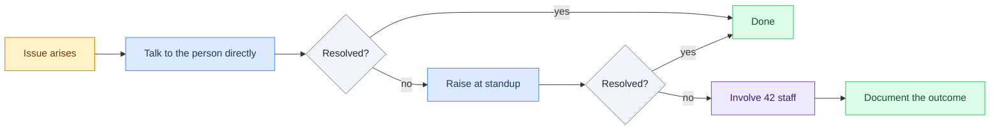

# Code of Conduct

Internal agreement for Team Univers42. Covers communication, accountability, code standards, and conflict resolution. Read once, apply always.

---

## How We Work

### Showing up

- Attend standups. If you can't make it, say so *before*, not after.
- Communicate blockers early. A blocker raised at standup is manageable. One raised the day of the deadline is a crisis.
- Keep your task status current on the board. No one should have to chase you to find out what's happening with your task.

### Owning your work

- If you break something, fix it or escalate immediately — don't wait to be asked.
- If you're stuck for more than an hour, ask for help. There is no prize for suffering alone.
- If you commit code you don't fully understand, that's your problem at evaluation, and everyone else's problem in maintenance.

### Code review

- Review is not optional. Nothing merges without at least one review.
- "LGTM" without reading the diff is not a review. Be specific: what's wrong, why it's wrong, how to fix it.
- The Tech Lead's code gets reviewed too. No exceptions.
- 24-hour review window. Don't leave PRs sitting.

### Communication

- Disagree in pull request comments, not in silence. Passive-aggressive git commits are not a communication strategy.
- If something said in review felt unfair, address it directly with that person — not to the rest of the team.
- Discord for async, standups for blocking issues, face-to-face for conflicts.

---

## What Is Not Acceptable

- Pushing directly to `main` or `develop` — the pre-push hook blocks it on purpose
- Ghosting: disappearing without notice for more than 24 hours during active sprints
- Committing code you cannot explain to an evaluator
- Taking credit for a teammate's commit in any context — evaluation, presentation, or conversation
- Leaving a PR open for more than 48 hours without reviewing it

---

## Roles

| Role | What they own |
|------|--------------|
| Product Owner | Feature definitions, acceptance criteria, evaluator-facing communication |
| Project Manager | Standups, deadline tracking, risk escalation before it becomes an emergency |
| Tech Lead | Architecture decisions, code standards enforcement, final call on technical disputes |
| Developer | Writing code, writing tests, documenting what they build, reviewing teammates' PRs |

The roles define accountability zones, not a hierarchy for daily decisions. Everyone codes. Everyone reviews. Everyone documents.

---

## Evaluation Accountability

At 42 evaluations, every member is expected to explain any part of the project. If you built a feature, you explain it. If your name is on the repo, you understand the architecture.

This means:
- No dividing the codebase into hermetic silos that only one person understands
- Pair programming or walk-throughs when working on anything architecturally significant
- Decisions documented in `docs/ARCHITECTURE.md`, not only in one person's memory

---

## Conflict Resolution

Whatever the outcome: write it down. Unresolved conflicts relitigate themselves at the worst possible moment.

---

## Enforcement

| Situation | Response |
|-----------|---------|
| First incident | Private conversation with PM or Tech Lead |
| Repeated or serious | Addressed at standup with the full team |
| Persistent | Adjusted responsibilities; if necessary, escalation to 42 staff |

---

*Adapted from [Contributor Covenant v2.1](https://www.contributor-covenant.org/version/2/1/code_of_conduct/) for team project use at 42.*
