# Team — Univers42

ft_transcendence · 42 Common Core · 2026

---

## Project Metadata

| Field | Value |
|-------|-------|
| School | 42 |
| Campus | [Campus name] |
| Project | ft_transcendence |
| Session | [Session / Promo] |
| Start date | January 2026 |
| Repository | [github.com/Univers42/transcendance](https://github.com/Univers42/transcendance) |
| Stack | TypeScript · NestJS · React · PostgreSQL · Docker |
| Theme | [TBD] |

---

## Team

| Login | Full Name | Primary Role | Secondary Role | GitHub | Primary focus |
|-------|-----------|--------------|----------------|--------|---------------|
| [dlesieur](https://profile.intra.42.fr/users/dlesieur) | Dylan Lesieur | ALL | ALL | [@LESdylan](https://github.com/LESdylan) | Auth, OAuth 2.0 |
| [danfern3](https://profile.intra.42.fr/users/danfern3) | Daniel Fernández | PO | PM | [@danielfdez17](https://github.com/danielfdez17) | Game engine, WebSockets |
| [serjimen](https://profile.intra.42.fr/users/serjimen) | Sergio Jiménez | PM | TL | [@DJSurgeon](https://github.com/DJSurgeon) | Backend architecture, CI |
| [alcacere](https://profile.intra.42.fr/users/alcacere) | Alex Cáceres | TL | PM | [@alcacere](https://github.com/alcacere) | Frontend, SCSS design system |
| [vjan-nie](https://profile.intra.42.fr/users/vjan-nie) | Vadim Jan Nieto | TL | ALL | [@vjan-nie](https://github.com/vjan-nie) | Database, Prisma, Docker |

:information_source: Notes about roles
- **PO** stands for *Product Owner*
- **PM** stands for *Project Manager*
- **TL** stands for *Technical Lead*
- **ALL** means that the person has all roles

:warning: We all have the role of *Developer* even though it is not mentioned :warning:

---

## Module Ownership

Who is the go-to person for each part of the codebase. Everyone can touch everything — this is about accountability, not silos.

```mermaid
graph TB
    subgraph Backend["Backend — NestJS"]
        auth["Auth / OAuth"]
        users["Users"]
        game["Game Engine"]
        chat["Chat / WebSockets"]
        rest["REST API layer"]
    end

    subgraph Frontend["Frontend — React + Vite"]
        pages["Pages / Routing"]
        components["Components"]
        stores["State — Zustand"]
        scss["SCSS Design System"]
    end

    subgraph Infra["Infrastructure"]
        docker["Docker / Compose"]
        ci["CI — GitHub Actions"]
        db["Database / Prisma"]
        hooks["Git Hooks"]
    end

    login1(["login1"]) --> auth
    login1 --> rest
    login2(["login2"]) --> game
    login2 --> chat
    login3(["login3"]) --> docker
    login3 --> ci
    login4(["login4"]) --> pages
    login4 --> components
    login4 --> scss
    login5(["login5"]) --> db
    login5 --> hooks

    style Backend fill:#ede9fe,stroke:#7c3aed,color:#3b1f6e
    style Frontend fill:#dbeafe,stroke:#3b82f6,color:#1e3a5f
    style Infra fill:#dcfce7,stroke:#22c55e,color:#14532d
```

---

## Working Agreement

| Item | Value |
|------|-------|
| Standups | [Time] on [Days] via [Platform] |
| Sprint length | 1 week |
| PR review window | 24 hours |
| Blocker escalation | Immediately at next standup |
| Communication | Discord — [#channel] |
| Board | GitHub Projects |
| Branch from | `develop` always |
| Merge strategy | Squash merge into `develop` |

---

## Contact

For questions about the project: Discord DM to the Project Manager.
For security issues: Discord DM to the Tech Lead — see [SECURITY.md](SECURITY.md).
For contribution workflow: [CONTRIBUTING.md](CONTRIBUTING.md).
