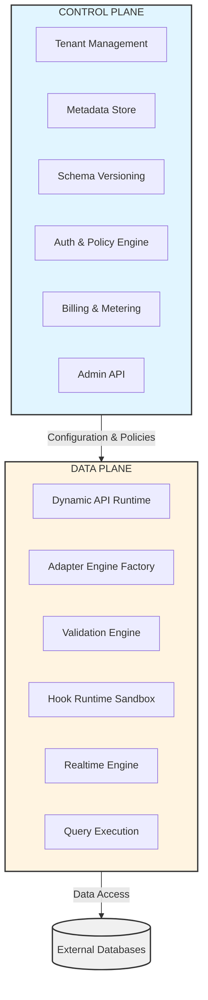
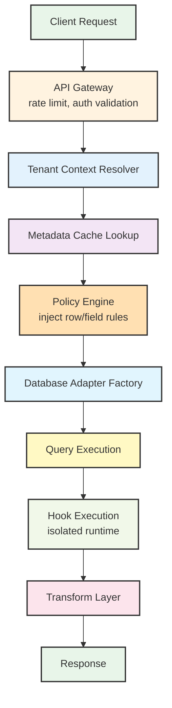
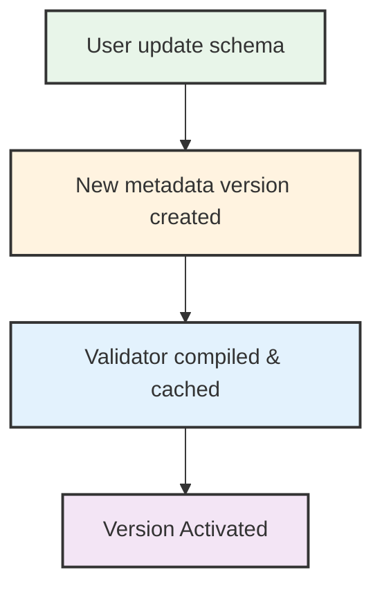
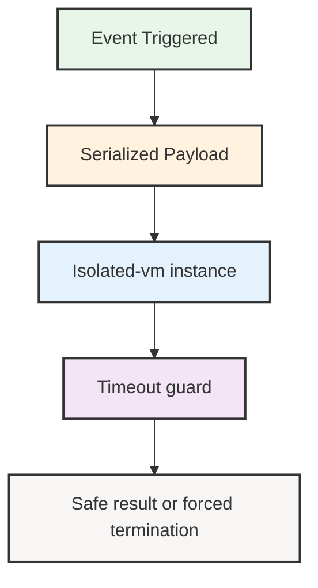

# Planning

## Key concepts
- Tenant: In the context of backend as a service (BaaS), a tenant refers to a user or group of users that share a single instance of a software application while having their data and configurations isolated from other tenants. This architecture allows multiple tenants to utilize the same backend resources efficiently while ensuring data privacy and security.

## **Multi-Tenant Isolation Strategy**

### Common Isolation Models

- **Shared DB + Shared Schema**

   * Every tenant share the same tables.
   * Isolation per `tenant_id` in each query.
   * Cheaper, but more risk on data leakage in case of filtering logic failure. ([xappifai.com][2])

- **Shared DB + Separate Schemas**

   * Same physical database.
   * Each tenants has its own logical *schema*.
   * Strong isolation with lower costs. ([xappifai.com][2])

- **Database per Tenant**

   * Each tenant has its own database.
   * Greater isolation and security.
   * More expensive in operations and connections. ([xappifai.com][2])

---

## **Control Plane vs Data Plane (SaaS Architecture)**

### **Control Plane**

Manages:

* Tenant management (onboarding/offboarding)
* Access policies
* Global configurations
* Billing and plans
  This plane should not handle sensitive tenant data directly. ([wild.codes][4])

### **Data Plane**

Handles:

* Data requests
* CRUD and specific logic
* DB connections per tenant
  And must scale independently from the control plane. ([wild.codes][4])

---

## **Permissions and Authorization**

* **RBAC** — Fixed roles (admin, editor, user).
* **ABAC** — Attribute-based policy (role *and* business conditions).
* **ReBAC** — Relationship-based (e.g., owners and resources).

In multi-tenant, the separation of roles and permissions must respect the *tenant boundary*.

#### Explanation

| Dimension                          | **RBAC** (Role-Based Access Control) | **ABAC** (Attribute-Based Access Control)                   | **ReBAC** (Relationship-Based Access Control)                           |
| ---------------------------------- | ------------------------------------ | ----------------------------------------------------------- | ----------------------------------------------------------------------- |
| **Core Idea**                      | Access based on user role            | Access based on attributes & policies                       | Access based on relationships between entities                          |
| **Decision Based On**              | `user.role`                          | User attributes + resource attributes + environment context | Graph relationships (user ↔ resource ↔ other entities)                  |
| **Example Rule**                   | “Admins can delete books”            | “Users can edit books where `ownerId == user.id`”           | “Users can edit books if they are in the same organization as the book” |
| **Granularity**                    | Coarse-grained                       | Fine-grained                                                | Very fine-grained                                                       |
| **Row-Level Control**              | ❌ Not native                         | ✅ Yes                                                       | ✅ Yes                                                                   |
| **Field-Level Control**            | ❌ Hard                               | ✅ Yes                                                       | ✅ Yes                                                                   |
| **Context-Aware (time, IP, etc.)** | ❌ No                                 | ✅ Yes                                                       | ⚠ Limited                                                               |
| **Scalability in Simple Systems**  | ✅ Very simple                        | ⚠ Moderate complexity                                       | ❌ Overkill                                                              |
| **Scalability in Complex SaaS**    | ❌ Becomes messy                      | ✅ Strong                                                    | ✅ Strong                                                                |
| **Policy Complexity**              | Low                                  | Medium to High                                              | High                                                                    |
| **Multi-Tenant Suitability**       | Basic separation only                | Very good                                                   | Excellent for org-based SaaS                                            |
| **Typical Implementation Pattern** | Role → Permission mapping table      | Policy engine evaluates rules dynamically                   | Graph traversal / relationship engine                                   |
| **Performance Cost**               | Very low                             | Moderate                                                    | Higher (graph queries)                                                  |
| **Common Use Cases**               | Admin dashboards, internal tools     | SaaS apps with ownership logic                              | Collaborative platforms (Notion, GitHub-style orgs)                     |

#### Example

##### RBAC - Static Role Mapping
```js
if (user.role === "admin")
	allow()
```

##### ABAC - Policy Evaluation
```js
allow if:
  user.tenantId == resource.tenantId &&
  resource.ownerId == user.id
```

##### ReBAC - Graph-Based Authorization
```js
allow if:
  user MEMBER_OF org
  AND org OWNS project
  AND project CONTAINS book
```

---

## **Scalability and Performance**

### Cache and tenant-aware caching

* Cache per tenant → prevents data contamination. ([UMA Technology][6])

### API Gateway multitenancy

* **Rate limiting per tenant**
* **CORS and WAF per tenant**
* **Tenant-scoped metrics** for observability. ([UMA Technology][6])

#### Definitions
- CORS, or Cross-Origin Resource Sharing, is a security feature that allows web applications to request resources from different origins (domains) while ensuring safe data transfers.
- WAF, or Web Application Firewall, is a security system that monitors and filters HTTP traffic to and from a web application to protect it from various attacks.

---

## **Multi-Tenant Observability**

* Store metrics *per tenant* (p95, errors)
* Log with tenant ID for auditing
* Implement distributed traces with tenant context

This will allow us to react to bottlenecks per client. ([Coretus Technologies][5])

#### Definitions
- In multi-tenant observability, p95 means `95th percentile latency`. It is a statistical measurement used to understand how slow the slowest “almost all” requests are.

So if `p95 latency = 240ms`, it means that:
- 95% of requests completed in <= 240ms
- Only 5% were slower than 240ms

---

## **Billing & Usage Metering**

Mature SaaS architecture not only serves data, it also:

* Counts API calls per tenant
* Calculates storage used per tenant
* Generates plans and limits by tiers
* Produces reports and invoices
  In other words: you must have *usage events* and *accumulators* in the control plane. ([Coretus Technologies][5])

---

## **Schema Evolution and Metadata Versioning**

Key concepts:

* **Metadata versioning:** each schema change must be associated with a *version tag*.
* **Metadata backups and rollback:** you'll need mechanisms to revert to a previous state.
* **Event-triggered migrations:** you can apply global or per-tenant migrations.

This topic is usually found in advanced books and articles on SaaS architecture and data engineering (e.g., O'Reilly on SaaS). ([O'Reilly Media][7])

---

## **Query Abstraction vs DSL (Domain Specific Language)**

A real BaaS usually requires:

* Basic CRUD (Create, Read, Update, Delete)
* Complex filters (AND/OR)
* Joins and relationships
* Cursor pagination
* Aggregations
* Multi-tenant transactions

Study how projects like Hasura or Prisma do it — both support complex queries translated to multiple engines.

---

## **Security, Compliance, and Data Custody**

It should be covered:

* **Strong data isolation**
* **Encryption at rest/in transit**
* **Access auditing**
* **Log protection**
* **GDPR/SOC2 compliance**

This affects not only code, but also DevOps processes and SaaS architecture. ([xappifai.com][2])

---

## **Infrastructure and Multi-Tenant Kubernetes**

If we will use Kubernetes, look at:

* Namespaces per tenant
* Strict ResourceQuotas
* NetworkPolicies
* Secret per tenant

This not only provides network isolation, but also operational control. ([Isitdev][8])

---

## Summary of Key References

Areas covered by real content:

| Topic                                  | Source                      |
| -------------------------------------- | --------------------------- |
| Multi-tenant strategies                | ([The Algorithm][1])        |
| Tenant isolation patterns              | ([xappifai.com][2])         |
| SaaS control/data plane architecting   | ([wild.codes][4])           |
| Billing & telemetry                    | ([Coretus Technologies][5]) |
| Observabilidad tenant-aware            | ([UMA Technology][6])       |
| Kubernetes multi-tenant best practices | ([Isitdev][8])              |
| SaaS design principles                 | ([O'Reilly Media][7])       |

---

[1]: https://www.the-algo.com/post/saas-architecture-best-practices-in-2025?utm_source=chatgpt.com "SaaS Architecture Best Practices in 2025"
[2]: https://www.xappifai.com/blog/saas-architecture-complete?utm_source=chatgpt.com "SaaS Architecture: Complete Guide to Building Scalable Multi-Tenant Systems | XAppifai Blog"
[3]: https://www.educative.io/newsletter/system-design/architecting-saas-multi-tenancy-for-isolation-and-scale?utm_source=chatgpt.com "Architecting SaaS Multi-Tenancy for Isolation and Scale"
[4]: https://wild.codes/candidate-toolkit-question/how-would-you-architect-a-secure-multi-tenant-saas?utm_source=chatgpt.com "How would you architect a secure multi-tenant SaaS?"
[5]: https://www.coretus.com/saas-platform-engineering-services/multi-tenant-saas-architecture-design?utm_source=chatgpt.com "Multi-Tenant SaaS Platform Engineering | Tenant Isolation, Billing, RBAC | Coretus"
[6]: https://umatechnology.org/multi-tenant-api-gateway-optimizations-for-backend-as-a-service-apis-rated-by-enterprise-architects/?utm_source=chatgpt.com "Multi-Tenant API Gateway Optimizations for backend-as-a-service APIs rated by enterprise architects - UMA Technology"
[7]: https://www.oreilly.com/library/view/building-multi-tenant-saas/9781098140632/ch02.html?utm_source=chatgpt.com "2. Multi-Tenant Architecture Fundamentals - Building Multi-Tenant SaaS Architectures [Book]"
[8]: https://isitdev.com/multi-tenant-saas-architecture-cloud-2025/?utm_source=chatgpt.com "Multi‑Tenant SaaS Architecture on Cloud (2025) — Practical Guide"


# **SaaS Architecture**

## **1. Architectural Vision**

	We are not building a backend.

	We are building a programmable backend runtime.

The system must:

* Support unbounded tenant diversity
* Be engine-agnostic
* Adapt at runtime
* Provide strict tenant isolation
* Scale independently across planes
* Enable monetization and governance

## **2. High Level Architecture**

The platform will be separated into two macro domains:



## **3. Control Plane Architecture**
The Control Plane is responsible for platform governance, not data execution.

#### **Responsibilities**

* Tenant lifecycle (create / suspend / delete)
* Store tenant DB connection configs
* Metadata storage
* Policy definitions (RBAC / ABAC)
* Hook definitions
* Usage metering
* Billing computation
* Plan enforcement

#### **Design Principle**

	Control plane failure must NOT break data plane execution.

This means:

* Data plane must cache metadata
* Policy snapshots must be locally available
* DB adapter configs must be cached

### **3.1 Metadata Storage Design**
Each tenant will have:
```json
{
  "tenantId": "user_23",
  "dbConfig": {...},
  "schemaVersions": [
    { "version": 1, "entities": [...] },
    { "version": 2, "entities": [...] }
  ],
  "activeVersion": 2,
  "policies": {...},
  "limits": {...}
}
```

#### **Required Capabilities**
* Version tagging
* Rollback support
* Immutable historical versions
* Migration orchestration events

## **4. Data Plane Architecture**
The Data Plane executes user workloads.

It must be:

* Stateless: each request must contain all the information required to execute it.
* Horizontally scalable: we must be able to add more instances to handle more traffic.
* Tenant-aware: every execution path must carry tenant context (tenantId, schemaVersion, adapterType, policyContext).
* Adapter-injected per request: each request must dynamically resolve the correct database adapter (PostgersAdapter, MongoAdapter...).

### **4.1 Request Flow Diagram**



## **5. Multi-Tenant Isolation Strategy**
You must formally choose isolation at three layers:

### **5.1 Data Isolation**

Options:

1. Shared DB + tenant_id column
2. Shared DB + separate schema
3. DB per tenant
4. Cluster per tenant

#### **Recommended Hybrid Model**

* Small tenants → Shared DB + Row-Level Security
* Enterprise tenants → Dedicated database

This is how modern SaaS systems scale efficiently.

### **5.2 Compute Isolation**

Options:

* Shared pods (tenant context inside app)
* Kubernetes namespace per tenant
* Dedicated node pools per enterprise tenant

Use:

* Resource quotas
* CPU/memory limits
* Hook execution time caps

### **5.3 Cache Isolation**

Redis keys must be namespaced:
```bash 
tenant:user_23:entity:books:page:1
```
Never share cache keys across tenants.

### **6. Dynamic Schema & Versioning Pattern**

#### **Core Rule:**


Schema is immutable once activated.

New changes → new version.
```bash
v1 → v2 → v3
```

#### **Version Activation Flow**

#### **Backward Compatibility Strategy**

* Option A: Clients always use latest
* Option B: Client passes x-schema-version

## **7. Query Abstraction Layer Design**
Our current CRUD interface is insufficient long-term.

We need a Query DSL (Domain Specific Language).

Example of internal representation:
```js
{
  filter: { price: { gt: 10 } },
  sort: [{ field: "createdAt", order: "desc" }],
  limit: 20,
  cursor: "abc123",
  relations: ["author"]
}
```

Adapters translate this into:

* SQL (Knex)
* Mongo query object
* Future engines

This allows:

* Aggregations
* Joins
* Nested relations
* Cursor pagination
* Transaction abstraction

## **8. Authorization Model**
We need a hybrid ABAC + Row-Level strategy.

### **Policy Injection Pattern**
Instead of 
```js
adapter.findMany("books", {})
```
We rewrite internally:
```js
adapter.findMany("books", {
	ownerId: currentUser.id
})
```

### **Layers of Authorization**

1. Tenant boundary
2. Role-based permission
3. Row-level constraint
4. Field-level masking

## **9. Hook Execution Model**
Hooks must be:

* Time limited
* Memory limited
* Network restricted
* Executed in isolated VM

Execution flow:


## **10. Observability Model**
Observability must be tenant-aware.

### **Metrics**

* p95 latency per tenant
* error rate per tenant
* query volume per tenant
* storage usage per tenant

### **Logging**

All logs must include:
* tenantId
* requestId
* schemaVersion
* adapterType

## **11. Billing & Meeting Architecture**
Usage events emitted by data plane:
```js
{
  tenantId,
  type: "read" | "write" | "storage" | "hook_cpu",
  units: number,
  timestamp
}
```
Events go to:
```
Data Plane → Usage Event Stream → Control Plane Billing Aggregator
```
Never compute billing inside request cycle.

## **12. Caching Strategy**

We need three layers:

* Metadata Cache (per tenant)
* Compiled Validator Cache
* Query Result Cache (optional)

All must be:

* TTL controlled
* Tenant namespaced
* Invalidated on schema version change

## **Consistency Model**
We must explicitly define guarantees:

| Feature            | SQL  | Mongo            | Platform Guarantee |
| ------------------ | ---- | ---------------- | ------------------ |
| Transactions       | ACID | limited          | Best effort        |
| Strong consistency | Yes  | Yes (single doc) | Engine-dependent   |
| Cross-engine join  | No   | No               | Not supported      |

Never promise more than the weakest engine supports.

## **14. Deployment Topology**

Recommended baseline:

```
Kubernetes Cluster
├── control-plane namespace
├── data-plane namespace
├── redis
├── monitoring stack
```
Enterprise tier:

* Dedicated namespace
* Dedicated DB
* Separate autoscaling group

## **15. Failure Domains**

Design so that:

* Tenant DB outage affects only that tenant
* Hook crash does not crash worker
* Control plane downtime does not break cached data plane
* Redis outage degrades performance, not correctness

## **16. Governance & Limits**

Every tenant must have enforced limits:

* Max entities
* Max fields per entity
* Max payload size
* Max hook CPU
* Max requests per minute

These are defined in control plane and enforced in gateway/data plane.

In our BaaS context, governance means:
```
The set of rules, limits, controls, and enforcement mechanisms that ensure the platform is used safely, fairly, predictably, and sustainably.
```

In our architecture, governance answers questions like:

* Who is allowed to do what?
* How much can they use?
* What are the limits?
* What happens if they exceed them?
* How do we prevent abuse?
* How do we ensure compliance?

## **17. System Maturity Stages**

You should think in stages:

- Stage 1 — Logical multi-tenancy
- Stage 2 — Query DSL + policy injection
- Stage 3 — Versioned metadata
- Stage 4 — Billing + quotas
- Stage 5 — Enterprise isolation tiers

## **18. Final Architectural Principles**

1. Metadata is the source of truth.
2. Isolation must exist at every layer.
3. Control plane and data plane must be separable.
4. Never promise stronger guarantees than weakest engine.
5. Every feature must be tenant-aware.
6. Performance must be cache-driven.
7. Governance must be enforceable automatically.