# Contributing to ft_transcendence

Everything you need to know before writing code on this project. Architecture, conventions, how to test, how to style, how to commit. If something isn't covered here, ask on Discord.

---

## Table of Contents

- [Getting Started](#getting-started)
- [Project Architecture](#project-architecture)
- [Directory Structure](#directory-structure)
- [Frontend — React + Vite](#frontend--react--vite)
- [Backend — NestJS](#backend--nestjs)
- [SCSS & the Graphical Chart](#scss--the-graphical-chart)
- [Testing](#testing)
- [Git Flow](#git-flow)
- [Branch Naming](#branch-naming)
- [Commits](#commits)
- [When to Commit](#when-to-commit)
- [Git Hooks](#git-hooks)
- [Pull Requests](#pull-requests)
- [Code Standards](#code-standards)
- [Code Review](#code-review)
- [Issues](#issues)
- [Vendor Directory](#vendor-directory)
- [AI Transparency](#ai-transparency)
- [Cheat Sheet](#cheat-sheet)
- [Git Cheatsheet](#git-cheatsheet)
- [References](#references)

---

## Getting Started

```bash
git clone git@github.com:Univers42/transcendence.git || git clone https://github.com/Univers42/transcendence.git
cd transcendence
cp .env.example .env
make          # first-time setup
make dev      # start everything
```

Then create your branch from `develop`:

```bash
git checkout develop && git pull
git checkout -b feature/my-thing
```

### Commands you'll use daily

| Command | What it does |
|---------|-------------|
| `make dev` | Start frontend + backend |
| `make test` | Run all tests |
| `make lint` | ESLint |
| `make typecheck` | TypeScript checks |
| `make gen-css` | Compile SASS once |
| `make gen-css WATCH=1` | SASS in watch mode |
| `make configure-hooks` | Install git hooks |
| `make shell` | Shell into the container |
| `make help` | List everything |

---

## Project Architecture

Here's the big picture — how the pieces connect:

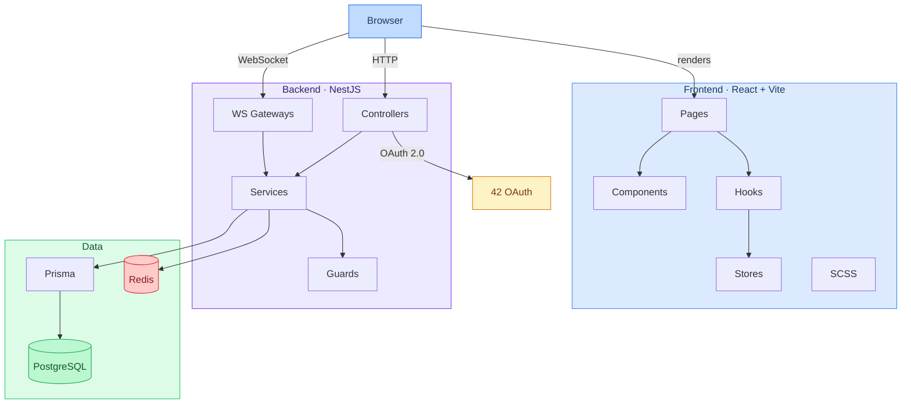

### File tree

```
ft_transcendence/
├── apps/
│   ├── backend/             # NestJS API
│   └── frontend/            # React SPA
├── packages/
│   └── shared/              # Shared types & utils
├── docker/                  # Dockerfiles, nginx
├── docs/                    # Extra docs
├── scripts/                 # Helper scripts
└── vendor/                  # Third-party & 42 tools
```

### Where does my code go?

| I need to… | Put it in |
|------------|-----------|
| New API route | `apps/backend/src/<module>/` |
| React component | `apps/frontend/src/components/` |
| Shared types | `packages/shared/src/types/` |
| Styles | `apps/frontend/src/styles/` |
| DB model | `apps/backend/prisma/schema.prisma` |
| Docker config | `docker/` |

---

## Directory Structure

### Backend

```
apps/backend/
├── prisma/
│   ├── schema.prisma        # DB models
│   └── migrations/
├── src/
│   ├── main.ts              # Entry point
│   ├── app.module.ts        # Root module
│   ├── auth/                # Auth (JWT, OAuth, 2FA)
│   ├── users/               # Users
│   ├── chat/                # Chat (WebSockets)
│   ├── game/                # Pong game
│   └── common/              # Guards, pipes, decorators
├── test/
│   └── *.e2e-spec.ts        # E2E tests
├── prisma.config.ts
└── package.json
```

### Frontend

```
apps/frontend/
├── src/
│   ├── main.tsx             # Entry point
│   ├── App.tsx              # Root component
│   ├── components/          # UI components
│   ├── pages/               # Route-level pages
│   ├── hooks/               # Custom hooks
│   ├── stores/              # Zustand stores
│   ├── services/            # API calls
│   ├── styles/              # SCSS (see below)
│   └── utils/
├── index.html
├── vite.config.ts
└── package.json
```

---

## Frontend — React + Vite

How the React app is organized:

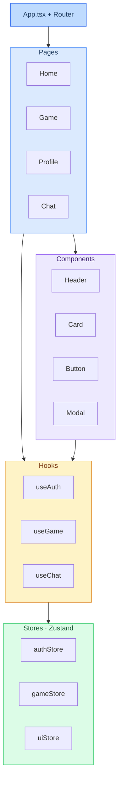

### How Vite builds things

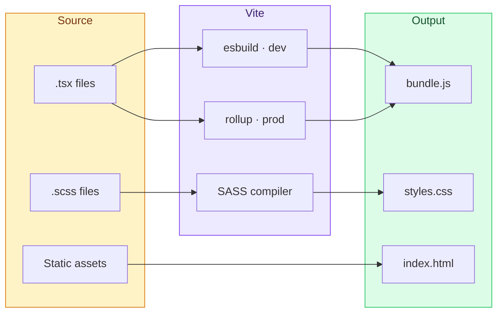

### Vite config highlights

```typescript
// Path aliases — use @/ instead of ../../
alias: {
  '@': path.resolve(__dirname, 'src'),
  '@shared': path.resolve(__dirname, '../../packages/shared/src'),
}

// SCSS — graphical chart is auto-imported everywhere
css: {
  preprocessorOptions: {
    scss: {
      additionalData: `@use "@/styles/abstracts" as *;\n`,
    },
  },
}
```

### Naming

| What | Convention | Example |
|------|-----------|---------|
| Components | PascalCase | `UserProfile.tsx` |
| Hooks | `use` prefix | `useAuth.ts` |
| Stores | camelCase + Store | `authStore.ts` |
| Types | PascalCase | `User.ts` |

### New component template

```tsx
import styles from './MyComponent.module.scss';

interface MyComponentProps {
  title: string;
}

export function MyComponent({ title }: MyComponentProps) {
  return <div className={styles.container}>{title}</div>;
}
```

---

## Backend — NestJS

Every request goes through this pipeline. If something blocks, check where it fails in this chain:

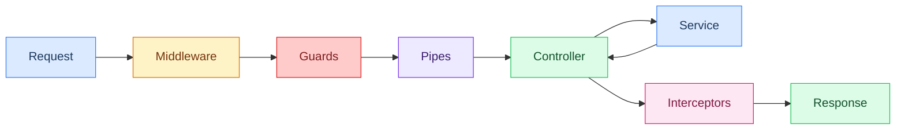

**Middleware** = logging, CORS, Helmet · **Guards** = auth checks · **Pipes** = validation · **Interceptors** = response shaping

### One module = one feature

```
src/users/
├── users.module.ts          # wires it all
├── users.controller.ts      # HTTP routes
├── users.service.ts         # logic
├── users.gateway.ts         # WS (if needed)
├── dto/
│   ├── create-user.dto.ts
│   └── update-user.dto.ts
├── entities/
│   └── user.entity.ts
└── users.spec.ts            # tests
```

### Scaffold a new module

```bash
docker exec -it transcendence-dev bash
cd apps/backend
nest g module myfeature
nest g controller myfeature
nest g service myfeature
```

### Quick reference

| Concept | Role | Files |
|---------|------|-------|
| Controllers | HTTP handlers | `*.controller.ts` |
| Services | Business logic | `*.service.ts` |
| Guards | Auth/authorization | `common/guards/` |
| Pipes | Validation | `common/pipes/` |
| DTOs | Request schemas | `*/dto/` |
| Gateways | WebSocket | `*.gateway.ts` |

---

## SCSS & the Graphical Chart

All styling goes through SASS. The **graphical chart** (`_graphical-chart.scss`) is the single source of truth for every color, size, font, and breakpoint. Nothing gets hardcoded.

### How it flows

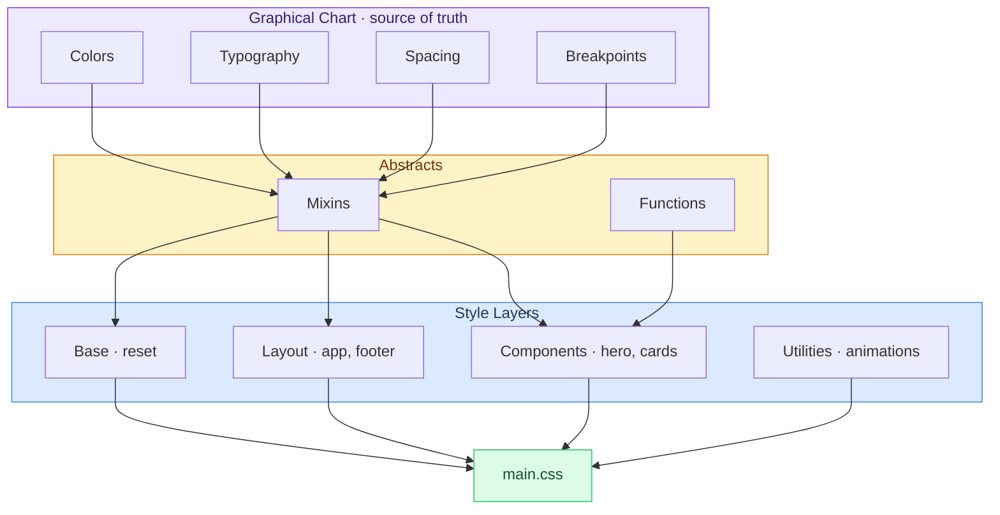

### Breakpoints — mobile first

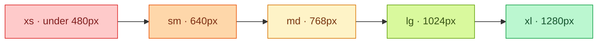

Use `@include sm-up`, `@include md-up`, etc. to go upward. Use `@include sm`, `@include md` to go downward.

### File structure

```
src/styles/
├── base/
│   ├── _graphical-chart.scss   # ALL tokens live here
│   └── _reset.scss
├── abstracts/
│   ├── _index.scss             # Re-exports chart + mixins
│   └── _mixins.scss
├── layout/
│   ├── _app.scss
│   └── _footer.scss
├── components/
│   ├── _hero.scss
│   ├── _cards.scss
│   └── _quickstart.scss
├── utilities/
│   └── _animations.scss
└── main.scss                   # Imports everything
```

### The golden rule

Never hardcode values. Always use variables from the graphical chart.

```scss
// Don't
.button {
  background: #7c3aed;
  padding: 12px 24px;
  border-radius: 8px;
}

// Do
.button {
  background: $accent;
  padding: $spacing-3 $spacing-6;
  border-radius: $radius-md;
}
```

### Available tokens

**Colors** — `$bg-primary`, `$bg-card`, `$text-primary`, `$text-muted`, `$accent`, `$accent-hover`, `$color-success`, `$color-error`, `$border-color`

**Typography** — `$font-family-sans`, `$font-family-mono`, `$font-size-xs` through `$font-size-5xl`, `$font-weight-normal` through `$font-weight-bold`

**Spacing** (8px grid) — `$spacing-1` (4px) through `$spacing-32` (256px)

**Breakpoints** — `$breakpoint-xs` (480px), `$breakpoint-sm` (640px), `$breakpoint-md` (768px), `$breakpoint-lg` (1024px), `$breakpoint-xl` (1280px)

### Mixins

```scss
@use '../abstracts' as *;

.thing {
  @include card;           // card pattern
  @include flex-center;    // center children
  @include focus-ring;     // a11y focus

  @include sm { /* < 640px */ }
  @include md-up { /* >= 768px */ }
}
```

### Adding styles

1. Create `apps/frontend/src/styles/components/_my-thing.scss`
2. Import abstracts and use chart variables
3. Add `@use 'components/my-thing';` in `main.scss`
4. Run `make gen-css` (or it auto-compiles in dev mode)

---

## Testing

We want most of our tests at the unit level, fewer at integration, fewest at E2E.

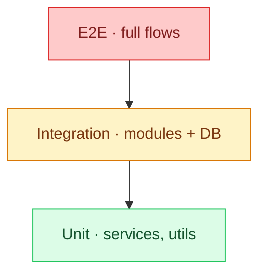

Aim for roughly: **70% unit · 20% integration · 10% E2E**.

### How to run

```bash
make test                     # everything

# Or inside the container:
pnpm test                     # unit
pnpm run test:e2e             # e2e
pnpm run test:watch           # TDD mode
pnpm run test:cov             # coverage report
```

### The dev loop

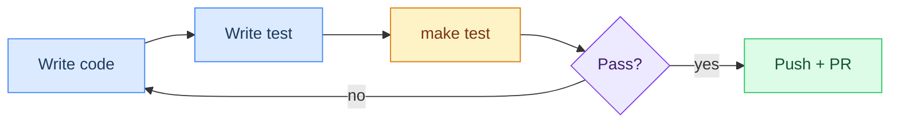

### Where tests live

```
apps/backend/
├── src/
│   └── *.spec.ts            # Unit tests (next to the code)
└── test/
    └── *.e2e-spec.ts        # E2E tests
```

### Unit test example

```typescript
import { Test, TestingModule } from '@nestjs/testing';
import { UsersService } from './users.service';

describe('UsersService', () => {
  let service: UsersService;

  beforeEach(async () => {
    const module: TestingModule = await Test.createTestingModule({
      providers: [UsersService],
    }).compile();
    service = module.get<UsersService>(UsersService);
  });

  it('should be defined', () => {
    expect(service).toBeDefined();
  });
});
```

### E2E test example

```typescript
import * as request from 'supertest';
import { AppModule } from '../src/app.module';
import { Test } from '@nestjs/testing';
import { INestApplication } from '@nestjs/common';

describe('Users (e2e)', () => {
  let app: INestApplication;

  beforeEach(async () => {
    const module = await Test.createTestingModule({
      imports: [AppModule],
    }).compile();
    app = module.createNestApplication();
    await app.init();
  });

  afterEach(() => app.close());

  it('GET /users', () =>
    request(app.getHttpServer())
      .get('/users')
      .expect(200));
});
```

---

## Git Flow

`main` is always production-ready. `develop` is where features land. Never push directly to either.

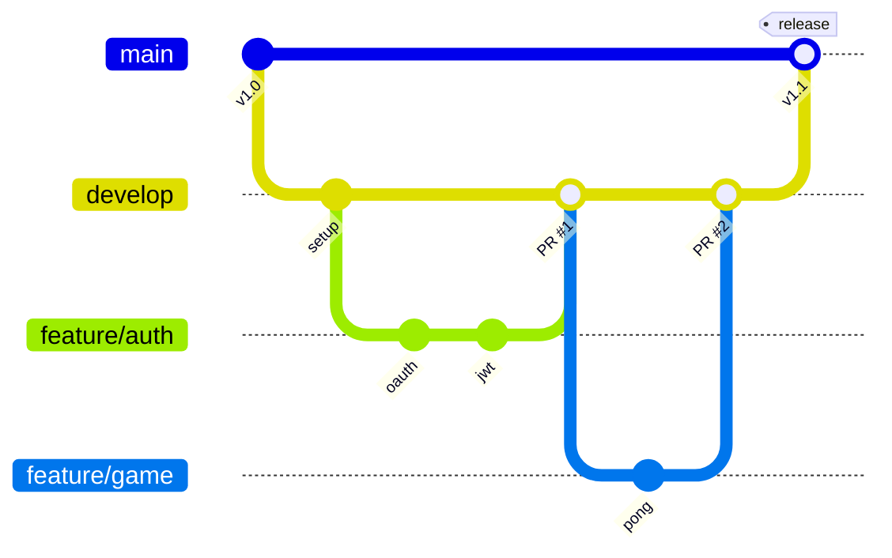

### Branch rules

| Branch | For | Merges into | Protected? |
|--------|-----|------------|------------|
| `main` | Production | — | Yes |
| `develop` | Integration | `main` via release | Yes |
| `feature/*` | New stuff | `develop` via PR | No |
| `fix/*` | Bug fixes | `develop` via PR | No |
| `hotfix/*` | Urgent prod fixes | `main` + `develop` | No |
| `release/*` | Release prep | `main` + `develop` | No |

### Rules

1. Never push to `main` or `develop` directly
2. Always branch from `develop`
3. Keep branches short — merge in 2–3 days
4. Delete branches after merge

---

## Branch Naming

```
<type>/<description>
```

| Type | Use for | Example |
|------|---------|---------|
| `feature/` | New feature | `feature/auth-oauth` |
| `fix/` | Bug fix | `fix/login-redirect` |
| `hotfix/` | Urgent prod fix | `hotfix/cors` |
| `release/` | Release | `release/1.0.0` |
| `docs/` | Docs only | `docs/api-endpoints` |
| `refactor/` | Cleanup | `refactor/extract-guards` |
| `test/` | Tests | `test/auth-e2e` |

---

## Commits

We use [Conventional Commits](https://www.conventionalcommits.org/). Every commit message is validated by a git hook (`commit-msg`) — if the format is wrong the commit is rejected.

```
type(scope): Short description starting with uppercase
```

| Type | Meaning |
|------|---------|
| `feat` | New feature |
| `fix` | Bug fix |
| `docs` | Documentation only |
| `style` | Formatting, whitespace — no logic change |
| `refactor` | Neither fix nor feature |
| `test` | Adding or updating tests |
| `chore` | Tooling, CI, deps, config |
| `perf` | Performance improvement |
| `ci` | CI/CD pipeline changes |
| `build` | Build system or external deps |
| `revert` | Reverts a previous commit |

**Scope** = module name: `auth`, `users`, `game`, `chat`, `docker`, `ci`, `prisma`, `hooks`…

**Rules enforced by the hook:**

- Description between 25 and 170 characters
- Must start with uppercase
- No trailing period
- Forbidden words: `WIP`, `squash!`, `fixup!`, `debug`, `temporary`

```bash
# Good
feat(auth): Add JWT refresh rotation with sliding window
fix(game): Clamp ball velocity on high-latency frames
docs(readme): Add environment variables table
test(chat): Cover websocket reconnect edge cases
chore(docker): Upgrade postgres to 16.2

# Bad — blocked by hook
fix(auth): fix stuff              # too vague, under 25 chars
feat(api): add endpoint.          # trailing period
WIP save progress                 # missing type(scope), forbidden word
feat(core): new feature           # lowercase start
```

**:warning: How to prevent bypassing this rule :warning:**

Before creating a commit message, execute `make` to ensure that the commit messages checker works as expected.

---

## When to Commit

A commit should represent **one logical unit of work** — not one line, not a whole day. Think of it as answering: *"if I revert this commit, what single thing disappears?"*

### Frequency guidelines

| Situation | Commit when… |
|-----------|-------------|
| New feature | Each piece that works on its own (route, component, migration…) |
| Bug fix | As soon as the fix is confirmed working |
| Refactor | After each rename, extract, or move — one refactor per commit |
| Styling | After each visual change you're satisfied with |
| Config / tooling | After each config file is done and tested |
| Tests | After adding tests for one module or function |

### Practical rhythm

- Roughly **every 20–45 minutes** of focused work, you should have something worth committing
- If it's been 2+ hours without a commit, you're probably bundling too many changes — split them
- If you commit every 2 minutes, you're probably too granular — group related lines

### Signs you need to commit right now

- You're about to switch to a different file/module
- You just ran `make test` and it passes
- You're about to try something risky and want a save point
- Your staged diff is getting hard to read

### Signs you need to split your commit

- Your `git diff --cached` touches more than 2–3 unrelated files
- You'd need the word "and" to describe what the commit does
- The description is longer than 170 characters

### The stash trick

When you realize mid-work that you have uncommitted stuff from a previous task:

```bash
git stash                           # park current work
git add <previous-task-files>
git commit -m "fix(api): Handle null body in POST /users"
git stash pop                       # resume current work
```

---

## Git Hooks

Hooks are shell scripts that run automatically at specific points in the git workflow. They keep the repo clean without relying on anyone's discipline.

### How they activate (zero-config)

Hooks activate **automatically** — you don't have to do anything. There are three independent triggers so no matter how a developer enters the project, hooks are set:

| Trigger | When it fires | How it activates hooks |
|---------|--------------|----------------------|
| `make` / `make dev` | First build or any dev session | Makefile runs `configure-hooks` as a dependency |
| `pnpm install` / `npm install` | Installing deps | Root `package.json` has a `prepare` script |
| `git checkout` | Switching branches (if hooks are already active) | `post-checkout` hook warns if `core.hooksPath` is missing |

Under the hood it's one git setting:

```
git config --local core.hooksPath vendor/scripts/hooks
```

This tells git "look in `vendor/scripts/hooks/` for hooks instead of `.git/hooks/`". The hooks are versioned files in the repo — no symlinks, no copying, nothing to install. Every `git pull` that updates a hook script takes effect immediately for everyone.

If for some reason they're not active:

```bash
make configure-hooks    # or manually:
git config --local core.hooksPath vendor/scripts/hooks
```

### What each hook does

```mermaid
graph LR
    edit["Edit files"] --> add["git add"]
    add --> precommit["pre-commit"]
    precommit --> commit["git commit"]
    commit --> commitmsg["commit-msg"]
    commitmsg --> done["Commit saved"]
    done --> push["git push"]
    push --> prepush["pre-push"]
    prepush --> remote["Remote"]

    style edit fill:#f1f5f9,stroke:#64748b,color:#1e293b
    style add fill:#f1f5f9,stroke:#64748b,color:#1e293b
    style precommit fill:#dbeafe,stroke:#3b82f6,color:#1e3a5f
    style commit fill:#f1f5f9,stroke:#64748b,color:#1e293b
    style commitmsg fill:#dbeafe,stroke:#3b82f6,color:#1e3a5f
    style done fill:#f1f5f9,stroke:#64748b,color:#1e293b
    style push fill:#f1f5f9,stroke:#64748b,color:#1e293b
    style prepush fill:#dbeafe,stroke:#3b82f6,color:#1e3a5f
    style remote fill:#dcfce7,stroke:#22c55e,color:#14532d
```

| Hook | Trigger | What it checks |
|------|---------|---------------|
| `pre-commit` | Before commit is created | Merge conflict markers, `debugger` statements, `.env` files, large files (>500 KB), trailing whitespace |
| `commit-msg` | After you write the message | Conventional commit format, description 25–170 chars, uppercase start, no trailing period, no forbidden words |
| `pre-push` | Before push reaches remote | All commits match format, tiered branch protection (see below) |
| `post-checkout` | After switching branch | Auto-pulls with `--ff-only` from upstream, warns if hooks are not active |
| `pre-merge-commit` | Before merge commit is created | Auto-pulls from upstream, asks confirmation if pull fails |

### Bypassing hooks

Every hook has an escape hatch via environment variable. Use them when you know what you're doing — not as a habit.

```bash
SKIP_PRE_COMMIT=1 git commit -m "chore(wip): Snapshot before refactor"
SKIP_COMMIT_MSG=1 git commit -m "whatever I want"
SKIP_PRE_PUSH=1 git push origin main
SKIP_POST_CHECKOUT=1 git checkout develop
SKIP_PRE_MERGE=1 git merge feature/something
```

You can also use `git commit --no-verify` to skip `pre-commit` and `commit-msg` entirely (built-in git option). But `pre-push` still runs unless you set `SKIP_PRE_PUSH=1`.

### Protected branches (tiered)

Not all branches get the same level of protection. Feature branches flow freely — the friction scales with the risk:

| Branch | Protection | What happens on `git push` |
|--------|-----------|---------------------------|
| `main` / `master` | **Hard gate** — password required | Must have `.git/allow_push` file with a password. The hook prompts for it. No password = push blocked. |
| `develop` | **Soft gate** — confirmation prompt | Y/n interactive prompt. Press Enter to confirm, `n` to cancel. |
| Feature branches | **None** | Push goes through. Commit messages are still validated. |

Setting up the password for `main`:

```bash
echo 'your-team-secret' > .git/allow_push    # local only, never committed
```

In CI or scripts, bypass interactively:

```bash
GIT_PUSH_OVERRIDE=your-team-secret git push origin main   # password match
GIT_CONFIRM_PUSH=yes git push origin develop               # auto-confirm
```

### Publish mode

For release commits that need a long description but not strict format:

```bash
GIT_PUBLISH=1 git commit -m "Release v1.2.0 — adds tournament mode with bracket generation, spectator view, real-time score updates, and admin dashboard for match management"
```

This only enforces a 25-word minimum.

### Hook logs

All hooks log to `.git/hook-logs/hook.log`. Check it when something goes wrong:

```bash
cat .git/hook-logs/hook.log
tail -20 .git/hook-logs/hook.log
```

### Debug mode

For verbose output from all hooks:

```bash
GIT_HOOK_DEBUG=1 git commit -m "feat(auth): Add session timeout handling for inactive users"
```

---

## Pull Requests

### The lifecycle

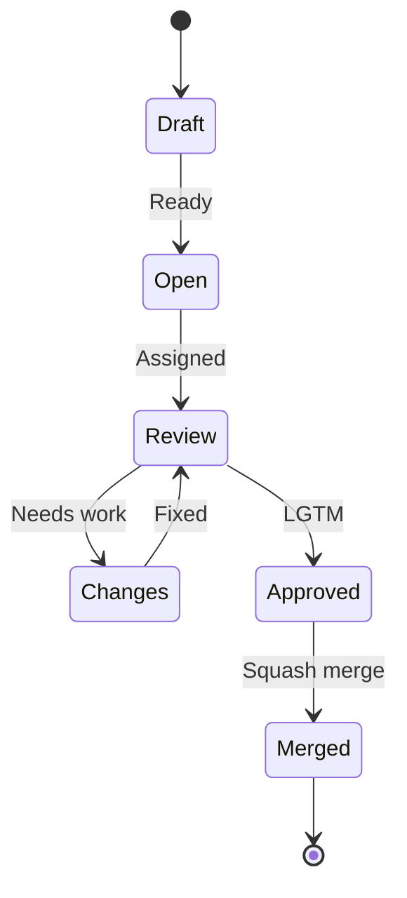

### What CI checks on every PR

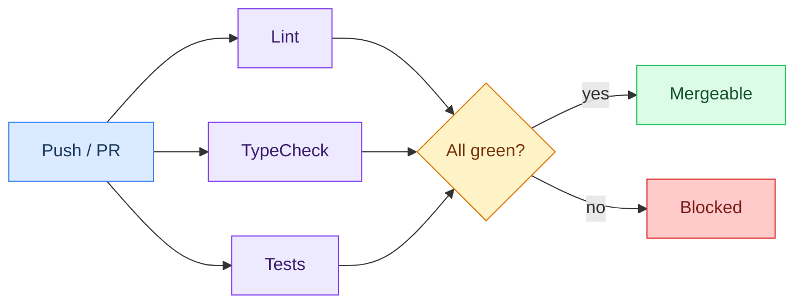

### Before you open one

- [ ] Rebased on `develop`
- [ ] `make test` passes
- [ ] `make lint` passes
- [ ] `make typecheck` passes
- [ ] Tested manually

### What goes in the PR

1. Title follows commit convention — `feat(auth): add google login`
2. Description says **what** and **why**
3. Link issues — `Closes #12`
4. Screenshots for UI changes
5. AI disclosure (see below)

### Review flow

1. Open PR, assign 1–2 reviewers
2. CI runs (lint + typecheck + tests)
3. Reviewer approves or requests changes
4. Address feedback
5. Squash merge into `develop`
6. Delete the branch

Try to review within **24 hours**. Ping on Discord if blocked.

---

## Code Standards

### TypeScript

- `strict: true` everywhere
- No `any` — use `unknown` and type guards
- Explicit return types
- `interface` over `type` for objects
- `readonly` by default

### Backend

- One module per feature
- DTOs for all validation (class-validator)
- Services hold logic, controllers are thin
- Document endpoints with Swagger decorators

### Frontend

- Functional components only
- Hooks for reusable logic
- Tests next to the component
- Lazy-load pages

### Naming

| What | Style | Example |
|------|-------|---------|
| Components | PascalCase | `UserProfile.tsx` |
| Hooks | usePrefix | `useAuth.ts` |
| Services | camelCase | `auth.service.ts` |
| Tests | same + `.spec` | `auth.service.spec.ts` |
| Types | PascalCase | `AuthPayload.ts` |

---

## Code Review

**Reviewers** — be kind, be specific. Say "this might cause X because…" not "this is wrong". Approve when it's good enough; perfect ships never.

**Authors** — don't take it personally. Respond to every comment. Don't force-push after review started — push new commits so the reviewer can track the diff.

---

## Issues

### How an issue moves

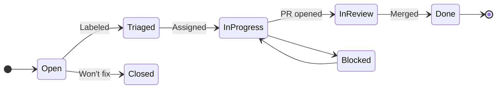

### Board

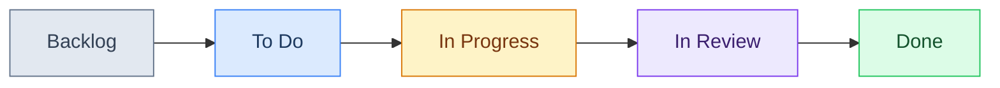

Every issue needs: clear title, labels, assignee, milestone. Use `Closes #42` in your PR to auto-close.

---

## Vendor Directory

`vendor/` holds third-party tools and 42-specific stuff. It's not part of the app itself.

```
vendor/
├── scripts/                 # Dev utilities
│   ├── checker.py           # Code validators
│   ├── clean_cache.sh       # Cache cleanup
│   ├── install-hooks.sh     # Git hooks setup
│   └── hooks/               # The actual hooks
└── set-debian/              # 42 VM setup (42 students only)
    ├── Makefile
    ├── setup/
    ├── preseeds/
    └── utils/
```

**Install git hooks:** `./vendor/scripts/install-hooks.sh`

The `set-debian/` directory automates Debian VM creation for 42 clusters. If you're not at 42, ignore it entirely.

Don't modify vendor scripts unless fixing a bug. New tools go in `scripts/` at the repo root.

---

## AI Transparency

Per 42's rules:

- Every PR states whether AI was used and for what
- Format: `AI assisted with: [task]` or `No AI used`
- If you can't explain the code at evaluation, don't submit it
- Review is the real quality gate — AI doesn't replace that

---

## Cheat Sheet

### Commands

```bash
make dev                 # dev servers
make shell               # container shell
make logs                # container logs
make lint                # eslint
make typecheck           # tsc
make test                # jest
make gen-css             # compile sass
make gen-css WATCH=1     # sass watch
make db-studio           # prisma studio
make db-migrate          # run migrations
make db-reset            # reset db
make configure-hooks     # install git hooks
make clean               # stop containers
make fclean              # nuke everything
make kill-ports          # free stuck ports
```

### File locations

| What | Where |
|------|-------|
| API routes | `apps/backend/src/*/` |
| React components | `apps/frontend/src/components/` |
| SCSS styles | `apps/frontend/src/styles/` |
| Design tokens | `apps/frontend/src/styles/base/_graphical-chart.scss` |
| DB schema | `apps/backend/prisma/schema.prisma` |
| Shared types | `packages/shared/src/types/` |
| Docker | `docker/` |
| CI | `.github/workflows/` |

### Git

```bash
git checkout develop && git pull
git checkout -b feature/my-thing
# ... work ...
git add . && git commit -m "feat(scope): What I did in detail"
git push -u origin feature/my-thing
# open PR to develop
```

---

## Git Cheatsheet

Quick reference. Copy-paste when you're stuck.

### Everyday workflow

```bash
# Start a new feature
git checkout develop && git pull
git checkout -b feature/login-form

# Save progress
git add -p                            # stage interactively (hunk by hunk)
git add src/components/LoginForm.tsx   # or stage specific files
git commit -m "feat(auth): Add login form with email validation"

# Push
git push -u origin feature/login-form  # first push sets upstream
git push                                # after that, just this
```

### Staging

| Command | Effect |
|---------|--------|
| `git add .` | Stage everything |
| `git add -p` | Stage interactively, hunk by hunk |
| `git add <file>` | Stage one file |
| `git reset HEAD <file>` | Unstage a file (keep changes) |
| `git diff --cached` | See what's staged |
| `git diff` | See what's NOT staged |

### Branching

| Command | Effect |
|---------|--------|
| `git branch` | List local branches |
| `git branch -a` | List all branches (local + remote) |
| `git checkout <branch>` | Switch branch |
| `git checkout -b <name>` | Create + switch |
| `git branch -d <name>` | Delete local branch (safe) |
| `git branch -D <name>` | Delete local branch (force) |
| `git push origin --delete <name>` | Delete remote branch |

### Syncing

| Command | Effect |
|---------|--------|
| `git fetch` | Download remote changes (no merge) |
| `git pull` | Fetch + merge |
| `git pull --rebase` | Fetch + rebase (cleaner history) |
| `git pull --ff-only` | Fetch + merge only if fast-forward |
| `git push` | Upload commits |
| `git push -u origin <branch>` | Push + set upstream tracking |

### Rebase

```bash
# Rebase your feature branch on top of develop
git checkout feature/my-thing
git fetch origin
git rebase origin/develop

# If conflicts:
# 1. Fix the files
# 2. git add <fixed-files>
# 3. git rebase --continue
# To bail out: git rebase --abort
```

### Stash

```bash
git stash                  # park uncommitted work
git stash list             # see stashed items
git stash pop              # restore + delete from stash
git stash apply            # restore + keep in stash
git stash drop             # delete top stash entry
git stash -m "description" # stash with a name
```

### Undo and fix

| Situation | Command |
|-----------|---------|
| Undo last commit (keep changes staged) | `git reset --soft HEAD~1` |
| Undo last commit (keep changes unstaged) | `git reset HEAD~1` |
| Undo last commit (destroy changes) | `git reset --hard HEAD~1` |
| Amend last commit message | `git commit --amend -m "new message"` |
| Amend last commit with more files | `git add <file> && git commit --amend --no-edit` |
| Discard all local changes | `git checkout -- .` |
| Discard changes to one file | `git checkout -- <file>` |
| Revert a pushed commit (safe) | `git revert <sha>` |

### Log and history

```bash
git log --oneline -20                  # last 20 commits, compact
git log --graph --oneline --all        # visual branch graph
git log --author="yourname" --since="1 week ago"
git show <sha>                         # full details of one commit
git diff HEAD~3..HEAD                  # what changed in last 3 commits
git blame <file>                       # who wrote each line
```

### Useful flags reference

| Flag | Used with | Meaning |
|------|-----------|---------|
| `-p` / `--patch` | `add`, `diff`, `log` | Show/stage individual hunks |
| `--oneline` | `log` | One commit per line |
| `--graph` | `log` | ASCII branch graph |
| `--cached` | `diff` | Compare staged vs last commit |
| `--soft` | `reset` | Undo commit, keep staged |
| `--hard` | `reset` | Undo commit, destroy changes |
| `--no-edit` | `commit --amend` | Amend without changing message |
| `--ff-only` | `pull`, `merge` | Only fast-forward, never create merge commit |
| `--rebase` | `pull` | Rebase instead of merge |
| `-u` | `push` | Set upstream tracking |
| `--force-with-lease` | `push` | Force push safely (fails if remote has new commits) |
| `--no-verify` | `commit`, `push` | Skip hooks |

---

## References

Stuff worth reading to get better at each area of this project.

### Architecture

| What | Link |
|------|------|
| The Twelve-Factor App | [12factor.net](https://12factor.net/) |
| Clean Architecture — R. C. Martin | [O'Reilly](https://www.oreilly.com/library/view/clean-architecture-a/9780134494272/) |
| Monorepo patterns | [monorepo.tools](https://monorepo.tools/) |
| Enterprise Patterns — Fowler | [martinfowler.com](https://martinfowler.com/books/eaa.html) |

### React & Frontend

| What | Link |
|------|------|
| React docs | [react.dev](https://react.dev/) |
| React + TypeScript cheatsheet | [GitHub](https://github.com/typescript-cheatsheets/react) |
| Bulletproof React (architecture) | [GitHub](https://github.com/alan2207/bulletproof-react) |
| Zustand docs | [pmnd.rs](https://docs.pmnd.rs/zustand/getting-started/introduction) |
| Vite guide | [vitejs.dev](https://vitejs.dev/guide/) |

### NestJS & Backend

| What | Link |
|------|------|
| NestJS docs | [docs.nestjs.com](https://docs.nestjs.com/) |
| NestJS fundamentals course | [courses.nestjs.com](https://courses.nestjs.com/) |
| Prisma docs | [prisma.io/docs](https://www.prisma.io/docs/) |
| JWT handbook — Auth0 | [Auth0](https://auth0.com/resources/ebooks/jwt-handbook) |
| Microsoft REST API guidelines | [GitHub](https://github.com/microsoft/api-guidelines) |
| WebSocket spec (RFC 6455) | [IETF](https://datatracker.ietf.org/doc/html/rfc6455) |

### CSS / SCSS

| What | Link |
|------|------|
| SASS docs | [sass-lang.com](https://sass-lang.com/documentation/) |
| CSS Guidelines — Harry Roberts | [cssguidelin.es](https://cssguidelin.es/) |
| ITCSS architecture | [xfive.co](https://www.xfive.co/blog/itcss-scalable-maintainable-css-architecture/) |
| W3C Design Tokens spec | [W3C](https://design-tokens.github.io/community-group/format/) |
| Every Layout | [every-layout.dev](https://every-layout.dev/) |
| Modern CSS | [moderncss.dev](https://moderncss.dev/) |

### Testing

| What | Link |
|------|------|
| Jest docs | [jestjs.io](https://jestjs.io/docs/getting-started) |
| Testing Library | [testing-library.com](https://testing-library.com/docs/) |
| NestJS testing guide | [NestJS docs](https://docs.nestjs.com/fundamentals/testing) |
| TDD — Kent Beck | [O'Reilly](https://www.oreilly.com/library/view/test-driven-development/0321146530/) |
| The Testing Trophy — Kent C. Dodds | [Blog](https://kentcdodds.com/blog/the-testing-trophy-and-testing-classifications) |

### Git

| What | Link |
|------|------|
| Conventional Commits | [conventionalcommits.org](https://www.conventionalcommits.org/) |
| Git Flow — Vincent Driessen | [nvie.com](https://nvie.com/posts/a-successful-git-branching-model/) |
| Semantic Versioning | [semver.org](https://semver.org/) |
| Pro Git book | [git-scm.com](https://git-scm.com/book/en/v2) |

### Docker & CI

| What | Link |
|------|------|
| Docker docs | [docs.docker.com](https://docs.docker.com/) |
| Docker Compose | [docs.docker.com/compose](https://docs.docker.com/compose/) |
| Dockerfile best practices | [Docker docs](https://docs.docker.com/develop/develop-images/dockerfile_best-practices/) |
| GitHub Actions | [docs.github.com/actions](https://docs.github.com/en/actions) |

### TypeScript

| What | Link |
|------|------|
| TypeScript Handbook | [typescriptlang.org](https://www.typescriptlang.org/docs/handbook/) |
| Type Challenges (practice) | [GitHub](https://github.com/type-challenges/type-challenges) |
| Total TypeScript | [totaltypescript.com](https://www.totaltypescript.com/) |

### Security

| What | Link |
|------|------|
| OWASP Top 10 | [owasp.org](https://owasp.org/www-project-top-ten/) |
| OWASP Cheat Sheets | [cheatsheetseries.owasp.org](https://cheatsheetseries.owasp.org/) |
| OAuth 2.0 explained | [oauth.net](https://oauth.net/2/) |

### Code Quality

| What | Link |
|------|------|
| Clean Code — R. C. Martin | [O'Reilly](https://www.oreilly.com/library/view/clean-code-a/9780136083238/) |
| Refactoring — Fowler | [refactoring.com](https://refactoring.com/) |
| The Pragmatic Programmer | [pragprog.com](https://pragprog.com/titles/tpp20/the-pragmatic-programmer-20th-anniversary-edition/) |
| Google Code Review guide | [Google](https://google.github.io/eng-practices/review/) |
| Airbnb JS style guide | [GitHub](https://github.com/airbnb/javascript) |

### 42

| What | Link |
|------|------|
| 42 Intra | [intra.42.fr](https://intra.42.fr/) |
| 42 API docs | [api.intra.42.fr](https://api.intra.42.fr/apidoc) |

### YouTube worth watching

| Channel | Focus | Link |
|---------|-------|------|
| Fireship | Quick tech explainers | [YouTube](https://www.youtube.com/@Fireship) |
| Theo (t3.gg) | React, TS, full-stack | [YouTube](https://www.youtube.com/@t3dotgg) |
| Jack Herrington | React architecture | [YouTube](https://www.youtube.com/@jherr) |
| Kevin Powell | CSS deep dives | [YouTube](https://www.youtube.com/@KevinPowell) |
| Web Dev Simplified | Fundamentals | [YouTube](https://www.youtube.com/@WebDevSimplified) |

---

*Got questions? Bring them to the next standup or drop them on Discord.*
