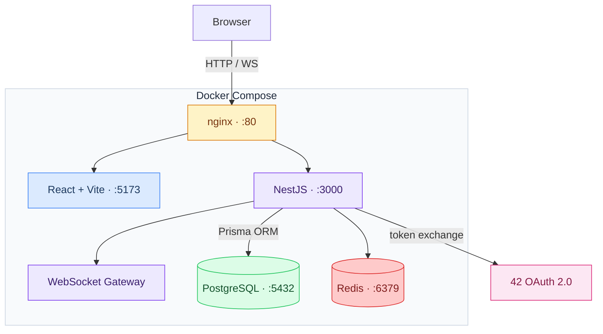

# ft_transcendence

*Created as part of the 42 school Common Core curriculum by dlesieur, danfern3, serjimen, alcacere and vjan-nie — Univers42, 2026.*

ft_transcendence is the capstone project of the 42 Common Core. One full-stack web application built from scratch by a team of five: backend, frontend, real-time communication, authentication, database design, containerization, and CI — all in one. The theme is free; ours is **[TBD — fill when decided]**.

---

## Table of Contents

- [Quick Start](#quick-start)
- [Theme](#theme)
- [Architecture](#architecture)
- [Bibliography](#bibliography)
- [Use of AI](#use-of-ai)
- [Why We Loved Working On It](#why-we-loved-working-on-it)

---

## Quick Start

The only dependency is Docker.

```bash
git clone git@github.com:Univers42/transcendence.git || git clone https://github.com/Univers42/transcendence.git
cd transcendence
cp .env.example .env
make
```

`make` builds the containers, installs dependencies, runs database migrations, and starts the dev servers. Git hooks activate automatically on the first run — nothing to install.

| Service | URL |
|---------|-----|
| Frontend | http://localhost:5173 |
| Backend API | http://localhost:3000 |
| Swagger | http://localhost:3000/api/docs |
| Prisma Studio | http://localhost:5555 |

For everything else — branch workflow, commit conventions, testing, SCSS — read [CONTRIBUTING.md](CONTRIBUTING.md).

---

## Theme

**[Theme to be determined by the team.]**

The technical stack is fixed by the subject: TypeScript end-to-end, real-time features, OAuth authentication, containerized deployment. The theme — what the application is actually *about* — is entirely our choice.

---

## Architecture



### Stack

| Layer | Technology | Version |
|-------|-----------|---------|
| Backend | NestJS | 11 |
| Frontend | React + Vite | 19 / 6 |
| Language | TypeScript strict | 5.7 |
| ORM | Prisma | 7 |
| Database | PostgreSQL | 16 |
| Cache / Pub-Sub | Redis | 7 |
| Package manager | pnpm workspaces | 10 |
| Reverse proxy | nginx | — |
| Containerization | Docker Compose | — |
| Styling | SCSS design system | — |

**Why this stack.**
NestJS gives us a real module system, dependency injection, and first-class WebSocket support without inventing it ourselves. React 19 with hooks-only keeps the frontend predictable at scale. Prisma handles migrations cleanly and generates typed queries from the schema. pnpm workspaces let us share TypeScript types between front and back without publishing to npm. Docker means every developer's environment is bit-for-bit identical — "works on my machine" stops being an excuse.

---

## Bibliography

Guides, specs, and references that directly informed technical decisions made in this project.

| Resource | What it informed |
|----------|-----------------|
| [The Twelve-Factor App](https://12factor.net/) | Config, build/run/release separation, stateless process design |
| [NestJS documentation](https://docs.nestjs.com/) | Module architecture, DI, guards, interceptors, WebSocket gateways |
| [Conventional Commits 1.0](https://www.conventionalcommits.org/) | Commit format enforced by our `commit-msg` hook |
| [JWT Best Practices — RFC 8725](https://datatracker.ietf.org/doc/html/rfc8725) | Token handling, short expiry, refresh rotation |
| [OAuth 2.0 — RFC 6749](https://datatracker.ietf.org/doc/html/rfc6749) | 42 OAuth integration and authorization code flow |
| [WebSocket Protocol — RFC 6455](https://datatracker.ietf.org/doc/html/rfc6455) | Real-time layer for game and chat |
| [OWASP Top 10](https://owasp.org/www-project-top-ten/) | Security baseline for every endpoint and auth decision |
| [OWASP CSRF Prevention](https://cheatsheetseries.owasp.org/cheatsheets/Cross-Site_Request_Forgery_Prevention_Cheat_Sheet.html) | Token validation and SameSite cookie strategy |
| [Prisma documentation](https://www.prisma.io/docs/) | Schema design, migrations, typed query generation |
| [Bulletproof React](https://github.com/alan2207/bulletproof-react) | Feature-based folder structure, state and service patterns |
| [ITCSS — Harry Roberts](https://www.xfive.co/blog/itcss-scalable-maintainable-css-architecture/) | SCSS layer architecture for our design system |
| [Monorepo patterns](https://monorepo.tools/) | pnpm workspaces, shared package setup |
| [Docker security best practices](https://docs.docker.com/develop/security-best-practices/) | Non-root containers, minimal base images, layer hygiene |
| [Google Engineering Practices](https://google.github.io/eng-practices/review/) | Code review expectations and PR lifecycle |
| [Pro Git — Scott Chacon](https://git-scm.com/book/en/v2) | Git internals, hooks, rebase strategy |

---

## Use of AI

We used AI tools during development. Here is what that means concretely:

- **Scaffolding** — initial module structure, test skeletons, DTO boilerplate
- **Debugging** — explaining compiler errors, suggesting fixes for runtime issues
- **Documentation** — drafting CONTRIBUTING.md, SECURITY.md, hook documentation, this README

What AI did not do: make architectural decisions, write business logic unsupervised or produce code that wasn't read, tested, and understood before being committed. Every AI suggestion went through the same code review process as anything else.

---

## Why We Loved Working On It

ft_transcendence is the first project at 42 where the constraint isn't the algorithm — it's the system. You can't solve it by writing clever code in one file. You have to make real decisions: which framework, which patterns, how to split the work, how to keep a codebase coherent across five people editing it in parallel.

The git hooks were a good example. Spending time hardening them — making them activate automatically on `make`, fail loudly on bad commits, protect `main` with a password gate — pays off immediately in team discipline without requiring anyone to remember to do anything.

Real-time is genuinely interesting. WebSocket lifecycle, reconnection logic, state synchronization between server and clients under latency — these are problems you don't encounter in CRUD exercises. They require you to think about time, ordering, and failure modes in a way most 42 projects don't.

The monorepo constraint forced us to build a shared type system. When the backend and frontend agree on types at compile time, you catch integration bugs before they become runtime surprises. That's an insight that doesn't come from reading about it.

The teamwork part is underrated. Five people on one codebase forced us to write readable code, document decisions, and communicate constantly. It's closer to professional software development than anything else in the curriculum — and it's harder, and more interesting, for exactly that reason.

---

*Detailed contribution guidelines, commit conventions, testing, and SCSS documentation: [CONTRIBUTING.md](CONTRIBUTING.md)*
*Team, roles, and module ownership: [TEAM.md](TEAM.md)*
*Security policy and vulnerability reporting: [SECURITY.md](SECURITY.md)*
