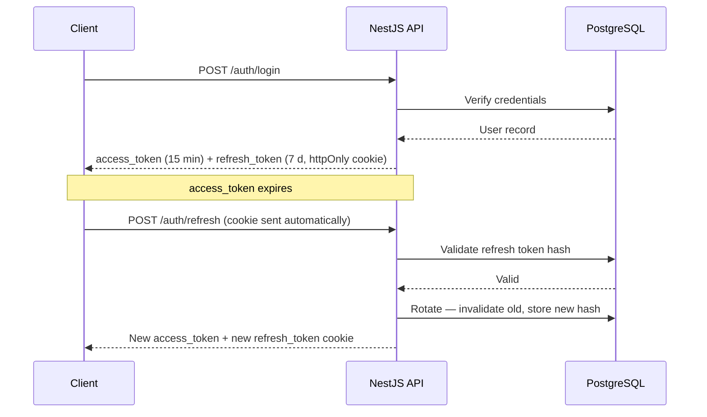
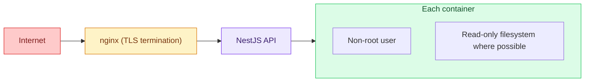

# Security Policy

---

## Reporting a Vulnerability

Do not open a public GitHub issue for security vulnerabilities.

Report privately by contacting the Tech Lead or Project Manager via Discord DM. Include:

- What the vulnerability is and where it is in the codebase
- Steps to reproduce
- What an attacker could do with it
- A suggested fix if you have one

| Step | Deadline |
|------|----------|
| Acknowledgment | 24 hours |
| Initial assessment | 48 hours |
| Fix — critical severity | 1 week |
| Fix — medium severity | 2 weeks |

---

## Security Model

### Authentication

- JWT access tokens with short expiry and refresh token rotation on each use
- 42 OAuth 2.0 via the [official 42 API](https://api.intra.42.fr/apidoc) — authorization code flow
- bcrypt for password hashing, minimum 12 salt rounds
- Session invalidation on password change and on any detected anomaly

Token lifecycle:

### Authorization

- Route-level guards on every protected endpoint — no endpoint is public by default
- Role-Based Access Control (RBAC) — roles checked at the guard layer, never in the controller
- No authorization logic in DTOs or validators

### Data Protection

- All inputs validated via `class-validator` DTOs — no raw user data reaches the service layer
- Parameterized queries only — Prisma never interpolates user input into SQL
- Strict Content-Security-Policy headers via Helmet.js
- Secrets in environment variables — the `pre-commit` hook blocks `.env` files from being staged
- HTTPS in production — TLS 1.3, HSTS enforced, HTTP redirected

### Infrastructure

- Non-root user in all production containers
- Helmet.js: CSP, X-Frame-Options, X-Content-Type-Options, Referrer-Policy, HSTS
- Per-IP and per-route rate limiting on all public endpoints
- CORS restricted to known origins only

### Dependencies

- `pnpm audit` runs in the CI pipeline on every PR
- Lock files committed — reproducible installs, no silent version drift
- No wildcard version ranges — all dependencies pinned to exact or `~minor`

---

## Scope

This is a 42 school project. The following are explicitly out of scope:

- Formal penetration testing or security audit
- SOC 2, ISO 27001, or any compliance framework
- Bug bounty program
- 24/7 incident response

Security is taken seriously as a technical discipline, not as compliance theater. The practices above reflect what a production service at this scale actually needs.

Starting: Create schema.abac.sql (2/8)

Now I have all the context I need. Let me create all the files. I'll start with the main schema.abac.sql file, which is the core of the system.

Let me design this carefully:

Schema Design: Enhanced ABAC Engine
The key design principles:

ABAC-first: attributes drive access decisions

RBAC as sugar: roles map to rule groups for convenience

Composable: atomic rules → rule groups (AND/OR/NOT) → policies

Temporal: every assignment can have start/end times

Dual-store: SQL for structure, MongoDB for flexible condition trees

Linux-inspired: capabilities model with ACL-like composability

Super admin bypass: only global_admin role skips evaluation

Deny-by-default, deny-wins at equal priority

Now I'm mapping out the core SQL tables. The attribute_definitions table will serve as a schema registry, validating what attribute paths are allowed across the system—things like user.department or resource.sensitivity—with support for different categories and data types, distinguishing between system-level and custom attributes that can be scoped per organization or globally.

The rules table holds individual evaluatable policies with allow/deny effects, priorities, and temporal constraints, while a condition_hash links to MongoDB for the actual condition logic. Rule groups then compose these atomic rules together using AND/OR/NOT logic, with a junction table managing membership and preventing circular references.

Now I'm mapping out the policy layer: policies are named containers with a default effect and priority that hold rule groups, and policy assignments determine who gets access (users, roles, organizations, etc.) with their own temporal windows for temporary access. The MongoDB side stores the actual condition trees that evaluate subject attributes against operators.

For permission resolution, I'm checking if the user is a super admin first to bypass everything, then collecting all applicable policies from their direct assignments and role-based assignments. policy) c. Context-scoped policies (org → project → workspace cascade) 3. Sort policies by priority (highest first) 4. For each policy: a. Fetch rule groups b. For each rule group, evaluate rules: - Fetch rule conditions from MongoDB - Evaluate condition tree against: * User attributes (from MongoDB abac_user_attributes) * Resource attributes (from request context) * Environment attributes (time, IP, etc.) - Apply combine_logic (AND/OR/NOT) c. If rule group evaluates TRUE → apply rule group's aggregate effect 5. First matching policy determines outcome 6. Fallback to RBAC: Check role_permissions → permissions 7. Fallback to legacy: Check abac_conditions, policy_rules 8. Default: DENY

This is comprehensive. Now I'm thinking about how to structure the implementation using a Linux-inspired capabilities model. Permissions map to atomic resource:action pairs like capabilities, rule groups function as composable ACLs per context, and the scope hierarchy mirrors Linux namespaces for org/project/workspace isolation. The effective permissions resolve from the combination of rules, roles, and policies.

I can adapt Linux's capability states—effective (currently active), permitted (maximum possible), inheritable (cascading to sub-contexts), and ambient (default for all users)—into the policy_assignments table with an inheritance_mode column. Now I need to write out the schema and figure out which tables are actually essential.

The three-layer structure of rules, rule groups, and policies is worth keeping because it mirrors established systems like Linux capabilities, AWS IAM, and OPA—rules are atomic and reusable, groups compose them with logic operators, and policies organize groups for assignment to targets. Without this hierarchy, I'd end up duplicating rules across policies or lose organizational clarity. Let me build the schema with this structure in place.

I need to handle the relationship between the legacy RBAC system and the new ABAC engine carefully. Since RBAC is essentially a special case of ABAC where rules evaluate role attributes and map to pre-configured policies, I should design the schema to support both systems running in parallel during migration—existing role permissions and conditions can be expressed as ABAC policies while the old system continues to work. Now I'm writing the SQL schema with clean documentation, proper constraints, and indexes.

Writing schema.sql... per-context composable rules) — Effective/Permitted maps to Policy evaluation with resolved permissions, Namespaces become Scopes for org/project/workspace isolation, and root (UID 0) translates to super_admin that bypasses all checks. The core principles are DENY by default, DENY wins when there's a conflict, rules compose into groups and policies, everything supports temporal constraints, and the system stays extensible through custom attributes and operators. I'm using a dual-store approach with SQL for structure and MongoDB for flexible condition trees.

For permission resolution, I start by checking if the user is a super admin to bypass everything, then look for explicit user denies which always take precedence. Next I evaluate ABAC policies by collecting applicable ones across user, role, org, project, and workspace levels, filtering for active temporal windows, sorting by priority, and evaluating rule groups by fetching conditions from MongoDB and testing them against user/resource/environment attributes. If no ABAC rule matches, I fall back to RBAC through role assignments, and ultimately deny access if nothing permits it. SQL + MongoDB split):
-- ┌─────────────────── PostgreSQL (Structure) ───────────────────┐ -- │ │ -- │ abac_attribute_defs ←── define what attributes exist │ -- │ abac_rules ←── atomic rule metadata │ -- │ abac_rule_groups ←── composable rule bundles (AND/OR/NOT)│ -- │ abac_policies ←── named policy containers │ -- │ abac_policy_assignments ←── who/where policies apply │ -- │ │ -- └──────────────────────────────────────────────────────────────┘ -- │ condition_id links │ -- ┌─────────────────── MongoDB (Flexibility) ────────────────────┐ -- │ │ -- │ abac_rule_conditions ←── nested condition trees │ -- │ abac_user_attributes ←── per-user custom attribute store │ -- │ │ -- └──────────────────────────────────────────────────────────────┘
-- Now I'm thinking through how composability works as the key differentiator. At the atomic level, I have individual rules like checking if a user's department matches or if a resource's sensitivity level is within bounds or if the current time falls within business hours. Then these rules combine into groups—for instance, an "Engineering Access" rule group that requires all conditions to match (the user must be in engineering AND the resource must have low sensitivity), versus something like "Business Hours OR VPN" where any single condition being true is sufficient.

The real power comes from nesting these groups within policies. A "Restricted Access" group can itself contain the "Engineering Access" and "Business Hours OR VPN" groups, creating complex hierarchical logic. When I assign a policy like "Engineering Default Policy" to specific roles and organizations, I can also add temporal constraints—this policy is valid only between certain dates. The execution order matters too; this schema needs to run after the base system schema is in place. I'm settling on storing conditions per-rule rather than per-rule-group since individual rules become more reusable and each one represents a distinct logical concept, while rule groups simply compose them together with boolean operators.

The mapping is straightforward: each SQL rule ID links to exactly one MongoDB document containing its condition tree, which can express complex nested logic like combining multiple attributes with AND/OR operators.

Defining the condition structure... I'm mapping out the remaining schema details: abac_rule_groups needs identity, ownership, combination logic, system flags, and a junction table to link rules and nested groups, while abac_policies sits at the top level with a default effect, priority ordering, active status, and assignment tracking to connect policies to specific resources or users.

Now I'm ready to write out all the files. I'm also clarifying how nested groups work—the junction table uses XOR logic to distinguish between atomic rules and child groups, with sort_order controlling evaluation sequence, which lets me build hierarchical rule structures like a parent group combining multiple rules and nested subgroups with their own logic operators.

I'll need a trigger to catch circular group references since that would break evaluation. For the attribute definitions, I'm settling on category values like 'subject', 'resource', 'environment', 'context', and 'custom' to align with ABAC terminology, plus data types covering strings, numbers, booleans, and their array variants along with dates.

For rules themselves, I need an effect field for 'allow' or 'deny', a target resource that can be null for all resources, and target actions as an array to let one rule cover multiple actions. For rule groups, I'm using 'and', 'or', 'not' for the combine logic since that's more intuitive than the formal ABAC terms. The policies table will need a default effect field to handle cases where no rules match.

For policy assignments, I'm keeping it simple with just target type and target id rather than overcomplicating it with inheritance modes—the application can handle cascading logic. Now I'm ready to write out the full schema following the same pattern as the other files, with detailed comments and relationship documentation.

I need to settle on naming for the attribute definitions table—abac_attribute_definitions is clearer than the shorter alternatives, even if it's a bit verbose. I should also make sure I'm properly referencing the existing tables like organizations, users, roles, and permissions from earlier schema files. I'm wondering whether to add a capability sets table following the Linux model, but that might be getting ahead of myself for now.

Writing schema.abac.sql... I'm mapping out how this ABAC engine mirrors Unix security concepts—permissions as atomic resource-action pairs, rule groups as composable ACLs, policies as named bundles, and a hierarchical scope system from org down to workspace, with super_admin as the root bypass and effects resolved at evaluation time through a priority chain.

Now I'm laying out the core invariants: deny-by-default semantics, explicit denies winning ties, a single super_admin role that fully bypasses evaluation, infinitely nestable rule composition, temporal bounds on every rule and assignment, custom attribute extensibility, and a dual-store architecture splitting identity and structure into SQL while condition trees live in MongoDB.

I'm starting to sketch the permission resolution algorithm itself, beginning with the request shape—user ID, action, resource type, resource ID, and context.

Then the evaluation flow: first check if the user is a super_admin for an immediate allow, then check direct user permissions for explicit denies or allows, then collect all applicable ABAC policies from direct assignments, role-based assignments, and the context cascade through workspace, project, and org levels, filter by active status and temporal validity, sort by priority, and iterate through each policy to evaluate its conditions.

For each policy, I'm fetching the rule groups from MongoDB and applying their logic—whether that's AND, OR, or NOT operations—to determine if the policy matches and return its effect. If no ABAC policy matches, I fall back to RBAC by checking role-based permissions, and if nothing grants access, the default is to deny.

The real power here is composability—I can build rules that check user attributes like department, resource attributes like sensitivity level, and environmental context like time of day or VPN status, then combine them in flexible ways. I'm thinking through how to structure admin roles more granularly—instead of a single admin role, I'd compose specialized variants like billing_admin, content_admin, and security_admin, each with only the permissions they actually need. This approach extends the existing RBAC system without breaking backward compatibility, so the current permissions and role assignments keep working as they are.

Now I'm laying out how the enhanced ABAC engine sits on top of the legacy system, evaluating conditions from both the old tables and new policy rules in sequence. I'm defining an attribute registry that acts as a schema for what attributes can appear in rule conditions, organized by categories like subject attributes for user-specific data. I'm defining the core table structure for attribute definitions, with fields for organization scope, naming, validation rules like regex patterns and allowed values, and system-managed flags to prevent tenant deletion of platform attributes. Setting up unique indexes to enforce that global attributes have unique names while organization-specific attributes are unique within their org, then adding documentation for the attribute definitions table before moving into the rules structure.

Each rule represents a single evaluatable condition with an effect, where the actual nested AND/OR/NOT condition trees live in MongoDB for flexibility. Rules target specific resource types and actions with either allow or deny effects, and can be time-bound using start and expiration timestamps to handle temporary access grants or scheduled policy changes.

The schema connects rules to organizations and users through foreign keys, links rules to condition documents in MongoDB, and associates rules with groups through a junction table—allowing me to traverse from a rule to its conditions or group memberships through straightforward join paths.

Defining the abac_rules table... I'm defining a rule groups table to bundle ABAC rules together with Boolean logic operators—AND for intersection, OR for union, and NOT for negation—and supporting nested composition so groups can contain other groups for arbitrary complexity. can contain sub-groups via abac_rule_group_members, enabling nested rule evaluation with AND/OR logic at multiple levels. The relationships show how groups connect to organizations, users, and policies, with system-managed groups marked as immutable and circular references prevented by a database trigger. There's also a recommended nesting depth limit of 10 levels enforced at the application layer.

Creating the table schema... Defining the junction table for rule group members, where each row links either an atomic rule or a nested sub-group to its parent group, with constraints ensuring exactly one of those two references is set and preventing circular references. Defining the table schema with constraints...

Now I'm adding documentation for the junction table and moving on to the policy structure—policies are the top-level containers that get assigned to users or roles, and they work by evaluating all their contained rule groups to determine whether to allow or deny access.

To illustrate how this works in practice, I'm showing two example policies: a "Billing Admin" policy that grants full access to billing resources and actions, and a "Security Admin" policy that grants full access to user and permission management, both scoped to specific roles and organizations. This demonstrates how the same user can have different access levels depending on which policy applies to them.

Now I'm mapping out the database relationships—policies connect to organizations, track who created them, and link to rule groups and assignments. I'm also noting some key implementation details: policies have a priority field that determines evaluation order, deny policies override allow policies at equal priority, system policies are protected from deletion, and version tracking enables optimistic concurrency control. Finishing the table schema with timestamps and a uniqueness constraint, then adding a junction table to link rule groups into policies where all groups must match for the policy to apply. Now I'm defining the policy assignments table to map policies to their targets—users, roles, organizations, projects, workspaces, or teams—with optional temporal constraints for temporary access grants.

I'm also mapping out how policies cascade through the scope hierarchy, where organization-level policies flow down to projects and workspaces unless a narrower scope overrides them with higher priority.

Defining the database schema... Adding performance indexes... Writing trigger functions... Writing the trigger function...

I'm verifying the circular reference logic—when we add a child group to a parent, we need to check if the parent is already a descendant of that child, which would create a cycle. Let me trace through an example: if Group A contains Group B which contains Group C, we can't then make A a child of C because that would loop back.

Now I'm moving on to define the MongoDB schemas for the ABAC rule conditions...

Defining the condition operators and logic types... Finishing up the schema with optional description and version fields, then moving on to define the user attributes schema which stores per-user ABAC attributes scoped to organizations, and now I need to set up the seed data for the system.