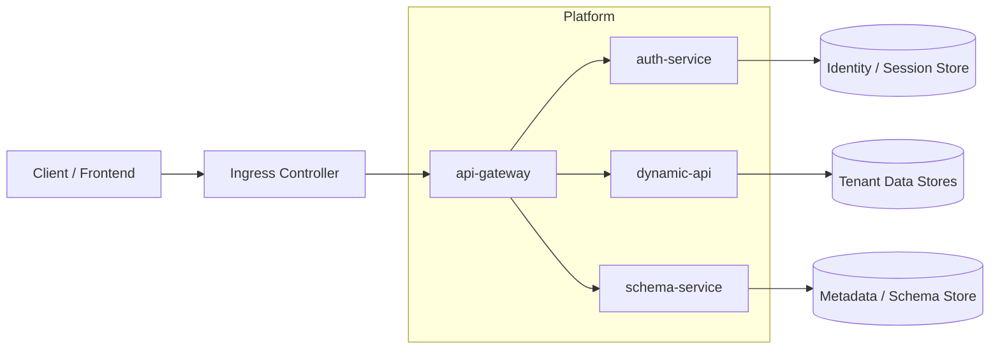
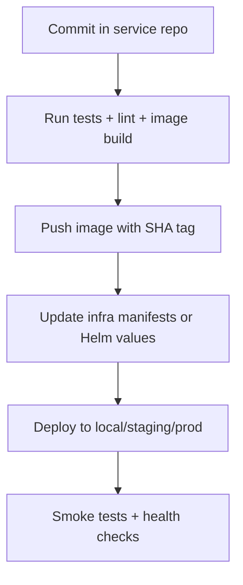

# mini-baas - Kubernetes Orchestration Blueprint (Phase 1)

> First research draft to organize `api-gateway`, `auth-service`, `dynamic-api`, `schema-service`, and `shared-library` as containerized workloads.

## 1. Purpose

This document defines a practical first architecture for moving from Docker Compose-oriented orchestration to Kubernetes-oriented orchestration, while keeping local developer velocity.

Goals:

- Keep service boundaries clear across multiple repositories.
- Standardize image, deployment, and environment conventions.
- Prepare an incremental path: local cluster -> staging -> production.
- Avoid over-engineering during the first migration.

---

## 2. Scope and Assumptions

### In scope

- Runtime orchestration for:
  - `api-gateway`
  - `auth-service`
  - `dynamic-api`
  - `schema-service`
- Packaging strategy for `shared-library` when consumed by runtime services.
- Baseline cluster architecture, CI/CD flow, and repository organization.

### Out of scope (for now)

- Service mesh (Istio/Linkerd) adoption.
- Multi-cloud failover.
- Full GitOps policy engines (OPA/Gatekeeper/Kyverno) in phase 1.

### Assumptions

- Each service can produce a Docker image.
- Images are published to a container registry (GHCR, Docker Hub, or private registry).
- `mini-baas` remains the strategic architecture/documentation hub.

---

## 3. High-Level Topology



Design principles:

- Single public entrypoint at `api-gateway`.
- Internal services exposed as `ClusterIP` only.
- Stateless services where possible, state externalized to databases/managed stores.

---

## 4. How To Treat `shared-library`

`shared-library` is typically not a standalone runtime service. In Kubernetes terms, it is usually a build-time dependency.

Recommended options (ordered):

1. Publish as package artifact (npm private registry or GitHub Packages) and consume in service builds.
2. Build a reusable base image layer that includes shared runtime dependencies.
3. Only create a standalone deployment if `shared-library` evolves into an actual network service (for example, a policy or transformation API).

Decision rule:

- If there is no HTTP/gRPC endpoint, do not deploy it as a Kubernetes `Deployment`.

---

## 5. Baseline Kubernetes Resources Per Service

Every runtime service should include at least:

- `Deployment`
- `Service` (`ClusterIP`)
- `ConfigMap`
- `Secret` references (never inline clear secrets)
- `HorizontalPodAutoscaler` (phase 2+)
- `PodDisruptionBudget` (phase 2+)
- `NetworkPolicy`
- `ServiceAccount` with least privilege

Edge/public components:

- `Ingress` for `api-gateway` only
- Optional `Ingress` for docs/health endpoints in non-production

Observability resources (phase 2+):

- `ServiceMonitor` (if Prometheus Operator exists)
- Standard labels for logs/traces (`app`, `service`, `version`, `environment`)

---

## 6. Repository and Folder Organization

Because the platform is multi-repo, keep deployment artifacts separated from app code but traceable.

### Recommended model

Create a dedicated infra repository, for example: `mini-baas-infra`.

```text
mini-baas-infra/
  kubernetes/
    base/
      api-gateway/
      auth-service/
      dynamic-api/
      schema-service/
    overlays/
      local/
      staging/
      production/
  helm/
    charts/
      api-gateway/
      auth-service/
      dynamic-api/
      schema-service/
    values/
      local/
      staging/
      production/
  argocd/
    applications/
  scripts/
    bootstrap-local-cluster.sh
    promote-image.sh
```

### Service repository convention

In each service repository:

```text
deploy/
  docker/
  k8s/
    README.md
```

Purpose:

- Service repos own image build logic and minimum deployment contract.
- Infra repo owns environment assembly, promotion, and cluster policies.

---

## 7. Environment Strategy

Use three environments from the beginning:

1. `local`: k3d or kind cluster for developer workflows.
2. `staging`: integration and load validation.
3. `production`: hardened policies, stricter scaling and security controls.

Recommended namespace pattern:

- `baas-local`
- `baas-staging`
- `baas-prod`

Do not mix staging and production in the same namespace.

---

## 8. CI/CD Flow (Simple First Version)



Image tag strategy:

- Immutable tag: `service:<git-sha>`
- Optional human tag: `service:vX.Y.Z`
- Never deploy `latest` in staging/production.

Promotion model:

- Promote by tag digest from staging to production.
- Rebuild only when source changes, not per environment.

---

## 9. Service Contract Matrix (First Pass)

| Service | Exposed Outside Cluster | Depends On | Notes |
| --- | --- | --- | --- |
| `api-gateway` | Yes (Ingress) | `auth-service`, `dynamic-api`, `schema-service` | Only public entrypoint |
| `auth-service` | No | Identity/session store | Internal service only |
| `dynamic-api` | No | Tenant databases, metadata/config store | Main data-plane execution |
| `schema-service` | No | Metadata/config store | Control-plane schema operations |
| `shared-library` | No (normally) | N/A | Prefer package/base-image, not deployment |

---

## 10. Security Baseline

Apply from phase 1 whenever possible:

- Run containers as non-root.
- Set `readOnlyRootFilesystem` when feasible.
- Pin image versions and scan images in CI.
- Use sealed/external secrets manager (SOPS, External Secrets, Vault) for non-local envs.
- Restrict east-west traffic with `NetworkPolicy`.
- Use separate service accounts per service.

---

## 11. Migration Roadmap

### Phase 1 - Foundation (research + first manifests)

- Define service runtime contracts (ports, env vars, health probes).
- Build and push first versioned images for all runtime services.
- Create local Kubernetes manifests (or Helm charts) and run on k3d/kind.
- Keep Docker Compose for fallback until local parity is stable.

### Phase 2 - Staging readiness

- Add autoscaling, PDBs, and observability.
- Add CI pipeline steps for image push + staging deployment.
- Add smoke tests against ingress endpoints.

### Phase 3 - Production hardening

- Enforce policy checks (image signatures, admission controls).
- Introduce GitOps promotion workflow.
- Formalize backup, rollback, and incident runbooks.

---

## 12. First Deliverables Checklist

- Architecture decision record: "Kubernetes for runtime orchestration".
- Infra repository bootstrap (`mini-baas-infra`).
- Per-service minimal Kubernetes deployment contract docs.
- Local cluster bootstrap script (`k3d` or `kind`).
- Staging namespace deployment with immutable image tags.

---

## 13. Open Questions Before Implementation

- Which ingress controller and certificate strategy will be used (NGINX + cert-manager or cloud-native ingress)?
- Will staging and production use managed Kubernetes or self-hosted clusters?
- Where will container images live (GHCR, private registry, cloud registry)?
- Do we adopt Helm first, Kustomize first, or Helm + ArgoCD directly?
- Which service owns database migrations for shared data contracts?

---

## 14. Recommended Next Step

Create a short technical spike:

1. Deploy only `api-gateway` + `auth-service` to a local `k3d` cluster.
2. Validate service-to-service communication and health probes.
3. Validate one end-to-end login flow through ingress.
4. Freeze naming, labels, and environment variable conventions before scaling to other services.

This keeps risk low while quickly exposing operational constraints early.
