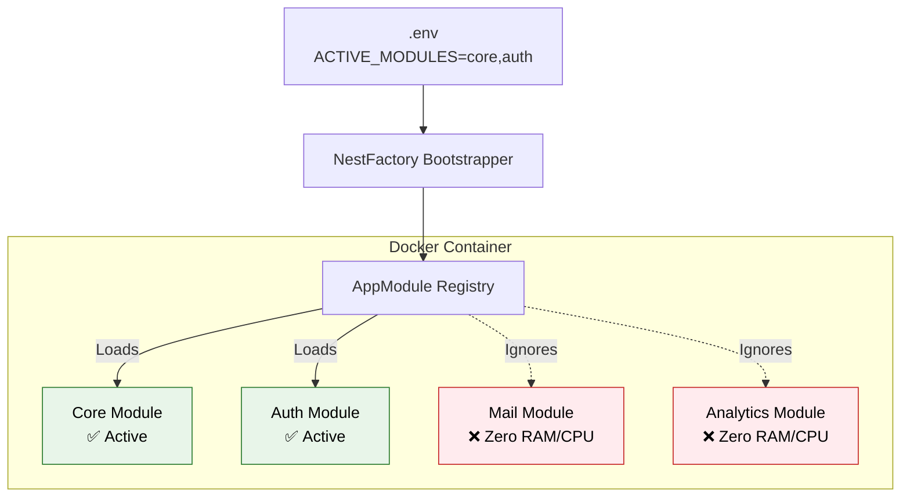
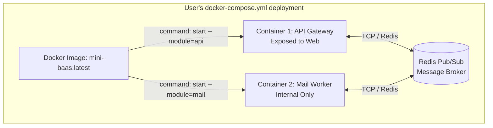

# mini-baas — Architecture Request for Comments (RFC): Module Isolation & Distribution

> **Date:** March 2026  
> **Topic:** Module Containerization vs. Monolithic Distribution  
> **Status:** Under Team Review  

## 1. Executive Summary

As we finalize Phase 0 and prepare to build the functional modules of `mini-baas` (Auth, Mail, Analytics, etc.), a critical architectural crossroad has emerged. 

The team has identified two somewhat conflicting goals for the final product:
1. **Granular Modularity:** Modules should be independent, togglable, and ideally isolated in their own execution contexts (containers) based on the end-user's needs.
2. **Frictionless Distribution:** The entire BaaS should ultimately be distributable as a **single, easy-to-deploy Docker image** for anyone wanting to self-host it.

This RFC explores the technical implications of moving from in-memory function calls (Monolith) to network-based communication (Microservices), and proposes three architectural paths to achieve the desired Developer Experience (DevX) and operational scalability.

---

## 2. The Core Dilemma: Memory vs. Network

When we separate modules into physical containers, we change the fundamental nature of how the system communicates. We cross the **Network Boundary**.

- **In a Monolith:** The `AuthModule` needs to send a welcome email. It imports the `MailService` and calls `MailService.send()`. Execution time: **~0.1ms** (in-memory pointer). Transaction rollback is native.
- **In a Distributed System (Containers):** The `Auth Container` needs to send an email. It serializes a message, sends it over TCP/Redis to the `Mail Container`, which deserializes it, processes it, and acknowledges. Execution time: **~5-20ms**. If the network blips, the email is lost unless retry queues (BullMQ) are implemented. Distributed transactions (Sagas) are required.

To ship a single Docker image while allowing module toggling, we must choose between logical isolation (compile-time) and physical isolation (runtime).

---

## 3. Architecture Options

### Option 1: The Dynamic Monolith (Logical Isolation)
**Strategy:** A single Docker container running the entire NestJS application, but utilizing **NestJS Dynamic Modules** to conditionally load or ignore code at startup based on environment variables.

* **How it works:** The user downloads `mini-baas:latest`. In their `.env` file, they specify `ACTIVE_MODULES=core,auth`. NestJS boots up, reads the variable, and strictly ignores the `Mail`, `GDPR`, and `Analytics` directories. Those modules consume zero CPU and zero RAM.
* **Database:** All active modules share the same connection pool and database adapter.
* **Distribution:** `docker run -p 3000:3000 mini-baas:latest`

### Option 2: Single Image, Multiple Entrypoints (Physical Isolation)
**Strategy:** We still ship a single `mini-baas:latest` Docker image, but the application is designed using `@nestjs/microservices`. The end-user orchestrates multiple containers using a `docker-compose.yml`, overriding the startup command for each container.

* **How it works:** The user spins up one container running the API Gateway, and a separate container running the Mail worker. They communicate internally via Redis Pub/Sub.
* **Database:** Strict domain boundaries. The Mail container cannot query the Auth tables directly.
* **Distribution:** Requires providing the user with a dynamic `docker-compose.yml` or a CLI generation tool.

### Option 3: Pure Microservices (Multiple Images)
**Strategy:** Each module has its own `package.json`, its own build pipeline, and its own Docker image (`mini-baas-core`, `mini-baas-mail`).
* **Verdict:** *Rejected for this phase.* It violates the primary goal of making the BaaS easily downloadable and self-hostable by external developers (who would have to pull and orchestrate 15 different images).

---

## 4. Comparative Analysis

| Feature / Metric | Option 1: Dynamic Monolith | Option 2: Single-Image Microservices |
| :--- | :--- | :--- |
| **End-User Setup** | Extremely Simple (1 container) | Moderate (Requires docker-compose config) |
| **Resource Footprint** | Low (Shared Node.js runtime) | High (Multiple Node.js V8 engines running) |
| **Internal Latency** | **~0.1ms** (In-memory calls) | **~5-20ms** (Redis network hops) |
| **Independent Scaling** | No (Scales as a whole unit) | Yes (Can spin up 5 Mail containers, 1 API) |
| **Fault Isolation** | Weak (A memory leak in Mail crashes Auth) | Strong (Mail crashes, Auth stays up) |
| **Engineering Cost** | Low (Standard NestJS DI) | High (Requires Sagas, Event Emitting, RPCs) |

---

## 5. Strategic Recommendation

### "Start Monolithic, Build Boundaries, Extract Later"

Prematurely adopting Microservices (Option 2) in Phase 1 introduces immense orchestration and networking complexity before the core domain logic is even proven. 

**The recommended path for `mini-baas` is to implement Option 1 (The Dynamic Monolith) while strictly enforcing internal boundaries.**

If we enforce strict Domain-Driven Design (DDD) now:
1. Modules **must not** share database tables directly.
2. Modules **must** communicate through well-defined Interfaces, not by reaching into each other's classes.
3. We implement an internal Event Emitter (`@nestjs/event-emitter`) for cross-module triggers instead of direct function calls.

By doing this, the system acts like a monolith (fast, easy to deploy as a single image, togglable via `.env`), but the architecture is completely decoupled. 

Later, when a module (like *Analytics* or *Webhooks*) demands heavy independent scaling, we can seamlessly migrate it to **Option 2** simply by swapping the internal Event Emitter for a Redis Pub/Sub microservice transporter, without rewriting the business logic.