# mini-baas — Strategic Architecture Document

> **One Backend to Rule Them All.**
> A metadata-driven, polyglot Backend-as-a-Service engine that lets any frontend — [React](https://react.dev/), [Vue](https://vuejs.org/), [Angular](https://angular.dev/), [Flutter](https://docs.flutter.dev/), [Swift](https://www.swift.org/documentation/), [Kotlin](https://kotlinlang.org/docs/home.html) — run against a single [NestJS](https://docs.nestjs.com/) instance, with any database engine, without writing a single backend route.

---

## Table of Contents

0. [Preamble](#preamble)
1. [Vision](#vision)
2. [Why mini-baas Exists](#why-mini-baas-exists)
3. [Core Principles](#core-principles)
4. [High-Level Architecture](#high-level-architecture)
5. [The Polyglot Engine — How It Works](#the-polyglot-engine--how-it-works)
6. [The Master Document — A Tenant's DNA](#the-master-document--a-tenants-dna)
7. [System Entity Model](#system-entity-model)
8. [Module Inventory](#module-inventory)
9. [Security Architecture](#security-architecture)
10. [Request Lifecycle](#request-lifecycle)
11. [Technology Stack](#technology-stack)
12. [Implementation Phases](#implementation-phases)
13. [Verification & Testing Strategy](#verification--testing-strategy)
14. [Key Architectural Decisions](#key-architectural-decisions)
15. [Codebase Map](#codebase-map)
16. [Future Roadmap](#future-roadmap-1)

---

## Preamble

Every time a developer starts a new project, they face the same invisible tax: authentication, authorization, validation, CRUD scaffolding, audit logging, multi-tenancy, rate limiting — all re-implemented from scratch or assembled from loosely integrated libraries. This is not accidental complexity. It is structural waste.

`mini-baas` exists to eliminate that tax.

The premise is simple but powerful: **if the behavior of a backend can be described in metadata, it can be generated at runtime without a single line of custom server code per tenant.** The tenant defines what data exists, what transformations apply, and what rules govern access — the platform interprets those definitions and executes accordingly. The same runtime serves a restaurant ordering system, a logistics tracker, and a social platform, without a single deployment per tenant.

This is not a new idea. Firebase, Supabase, and Hasura have all explored fragments of it. What `mini-baas` does differently is commit to the full contract: a metadata-driven, adapter-agnostic, self-hostable App Factory where tenant schemas, policies, hooks, and billing live as first-class runtime objects — not as code checked into a repository.

This document is the canonical blueprint for how `mini-baas` works and why every major architectural decision was made. It is not a product one-pager. It is an engineering manifesto:

- **Architects** will find the rationale for plane separation, database selection, and isolation models.
- **Developers** will find the interface contracts, adaptation strategies, and phased implementation plan.
- **Evaluators and academic reviewers** will find explicit tradeoff analysis, consistency guarantees, formal relational support, and measurable success criteria.

The strategy is deliberate and staged. It does not promise everything at once. It promises a clear path from a working MongoDB MVP to a multi-engine, multi-tenant platform with formal relational support — each phase building on the last, each decision made to preserve optionality for what comes next.

### Architectural Alternatives Considered

There are three obvious industry paths for building a BaaS, and `mini-baas` deliberately rejects all three as the primary strategy:

| Alternative | Strength | Weakness | Why It Is Not the Core Strategy |
|---|---|---|---|
| **Code + Infrastructure Generation** (Supabase-like) | Native performance, strong hard isolation | High orchestration cost, container sprawl, Kubernetes-heavy lifecycle management | Overkill for a self-hosted, single-command developer platform |
| **Serverless Edge** (Firebase / Cloudflare-like) | Massive scale and low end-user latency | Severe vendor lock-in, weak local self-hosting story | Conflicts with the project's self-hosted and auditable goals |
| **Pure NoSQL / Schema-less** (early Parse / Appwrite-like) | Fast iteration and highly flexible document storage | Weak relational guarantees, higher noisy-neighbor risk, harder academic defense for strict schema requirements | Too risky for environments that explicitly expect well-defined relations |

The chosen direction is a **metadata-driven modular monolith**: one shared fleet of application containers, one Control Plane for governance, and one Data Plane that mutates behavior at runtime from metadata. That gives us the operational simplicity of `docker-compose`, the portability of self-hosting, and the extensibility of a runtime interpreter instead of a deployment generator.

### Strategic Position for ft_transcendence

In the `ft_transcendence` context, architecture is not only about elegance. It is also about surviving evaluation constraints while still earning points for technical ambition.

| Requirement Pressure | Why the Architecture Helps |
|---|---|
| **Single-command deployment** | A modular monolith with shared infrastructure is compatible with one Docker Compose entrypoint |
| **Public API + framework requirements** | The Data Plane is already a universal API surface on top of NestJS |
| **Organization / tenant logic** | Multi-tenancy is native to the platform, not bolted on later |
| **Custom technical module** | The metadata engine, adapter layer, and runtime schema execution are themselves the custom module |

The biggest evaluation risk is the classic objection: *"the database must have a clear schema and well-defined relations."* A purely schema-less MongoDB story is weak in that environment. The mitigation is deliberate: MongoDB remains the right choice for the Control Plane, while the adapter layer preserves a PostgreSQL-compatible relational Data Plane path so the project can present a formal ER model when strict evaluators require it.

### Critical Technical Risks

This architecture is viable, but only if its hardest runtime risks are acknowledged explicitly:

- **Just-in-time validation bottleneck**: compiling validators on the hot path can saturate the Node.js event loop. Mitigation: compile once, cache per tenant/version, and pre-warm frequently used validators to avoid cold-start latency spikes.
- **`isolated-vm` memory trap**: sandboxing is necessary, but isolates still consume RAM and can become a denial-of-service vector if left unconstrained. Mitigation: hard CPU and memory limits, isolate pooling, and forced termination on budget overrun.
- **Observability hell**: dynamic schemas make ordinary stack traces insufficient. Mitigation: tenant-aware structured logs, request correlation IDs, and distributed traces across API, queue, and database boundaries.

If you question whether a metadata-driven approach can satisfy strict academic schema and relation requirements, [Section 9](#9-query-abstraction-and-adapter-strategy) and [Section 16](#16-strategic-position-for-ft_transcendence) address it directly. If you wonder how real isolation works in shared infrastructure, [Sections 7](#7-multi-tenant-isolation-model) and [8](#8-authorization-and-policy-enforcement) go deep. If you want to understand what "done" looks like in measurable terms, [Section 14](#14-slos-and-success-metrics) defines it precisely.

Read this document once to understand the vision. Read it again before any significant architectural decision.

---

## Layer Architecture

```bash
.
├── common
│   ├── crypto
│   ├── decorators
│   ├── exceptions
│   ├── interceptors
│   ├── interfaces
│   ├── schemas
│   └── types
├── infrastructure
│   ├── cache
│   └── system-db
├── modules
│   ├── analytics
│   ├── api-keys
│   ├── audit
│   ├── auth
│   │   ├── decorators
│   │   ├── dto
│   │   ├── guards
│   │   └── services
│   ├── control-plane
│   │   ├── iam
│   │   ├── metadata
│   │   │   └── dto
│   │   ├── provisioner
│   │   └── tenant
│   │       └── dto
│   ├── data-plane
│   │   ├── dynamic-api
│   │   ├── transformation
│   │   └── validation
│   ├── engines
│   │   ├── core
│   │   ├── nosql
│   │   └── sql
│   ├── files
│   ├── gdpr
│   ├── mail
│   ├── newsletter
│   ├── notification
│   ├── rbac
│   │   ├── decorators
│   │   ├── guards
│   │   └── services
│   ├── runtime
│   │   ├── background-jobs
│   │   └── hooks
│   ├── security
│   │   ├── guards
│   │   └── middleware
│   ├── session
│   └── webhook
└── studio
    ├── bootstrap
    ├── collections
    ├── config
    ├── environments
    ├── schemas
    ├── seeds
    └── types

61 directories

```
## Vision

mini-baas is a **metadata-driven App Factory**. It is the same pattern used internally by [Supabase](https://supabase.com/), [Hasura](https://hasura.io/), and [Appwrite](https://appwrite.io/) — but fully open, self-hostable, and database-agnostic from day one.

The idea is simple:

- **You describe** your application's data model, permissions, and hooks in a JSON document (the *Master Document*).
- **mini-baas generates** a full REST API, authentication system, file storage, webhooks, analytics, and more — at runtime, without code generation, without compilation, without deployment.
- **Your frontend talks** to universal endpoints like `GET /api/:tenantId/orders` and mini-baas figures out whether those orders live in [PostgreSQL](https://www.postgresql.org/docs/), [MongoDB](https://www.mongodb.com/docs/), [MySQL](https://dev.mysql.com/doc/), or [SQLite](https://sqlite.org/docs.html).

One backend. Any frontend. Any database. Any business model.

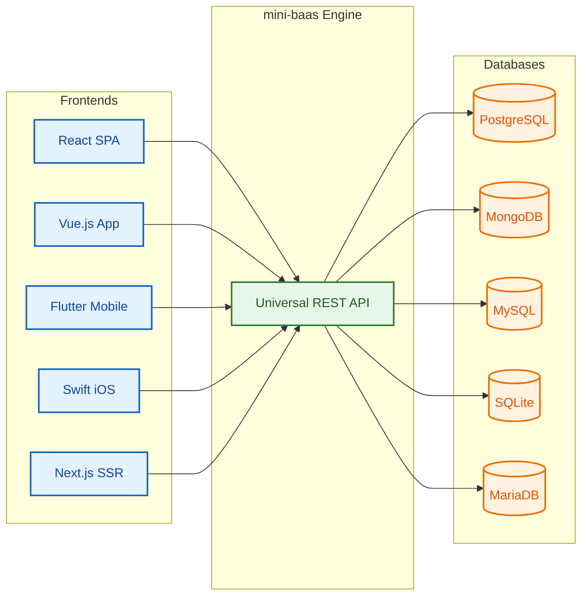
```mermaid
graph LR
    subgraph Frontends
        A[React SPA]
        B[Vue.js App]
        C[Flutter Mobile]
        D[Swift iOS]
        E[Next.js SSR]
    end

    subgraph mini-baas Engine
        F[Universal REST API]
    end

    subgraph Databases
        G[(PostgreSQL)]
        H[(MongoDB)]
        I[(MySQL)]
        J[(SQLite)]
        K[(MariaDB)]
    end

    A --> F
    B --> F
    C --> F
    D --> F
    E --> F
    F --> G
    F --> H
    F --> I
    F --> J
    F --> K

    classDef frontend fill:#E3F2FD,stroke:#1565C0,stroke-width:2px,color:#0D47A1;
    classDef engine fill:#E8F5E9,stroke:#2E7D32,stroke-width:2px,color:#1B5E20;
    classDef database fill:#FFF3E0,stroke:#EF6C00,stroke-width:2px,color:#E65100;

    class A,B,C,D,E frontend;
    class F engine;
    class G,H,I,J,K database;
```

---

## Why mini-baas Exists

Every modern web and mobile application needs the same 80% of backend functionality:

| Capability | Every App Rebuilds It |
|---|---|
| User registration & login | Yes |
| JWT/session authentication | Yes |
| Role-based access control | Yes |
| CRUD API for entities | Yes |
| File uploads | Yes |
| Email sending | Yes |
| Notifications | Yes |
| Audit trail | Yes |
| Webhooks | Yes |
| Rate limiting | Yes |
| GDPR compliance | Yes |

mini-baas eliminates that repetition. It provides **all of the above as universal, database-agnostic modules** that work through a single adapter interface. The backend doesn't know — and doesn't care — what business model you're building. It understands the *shape* of your data, not the *meaning*.

A restaurant ordering system, an e-commerce platform, a project management tool, a social network — they all need users, permissions, CRUD, and emails. mini-baas provides the infrastructure. You provide the schema.

---

## Core Principles

### 1. Zero Business Logic Awareness

The BaaS engine has **no knowledge of your domain model**. It doesn't know what an "order" or a "product" is. It knows that entity `orders` has fields `status: string`, `total: decimal`, `customerId: uuid` — and it serves a CRUD API, validates payloads, enforces permissions, and logs changes accordingly.

This is what makes it universal. A restaurant app and a hospital management system can run on the same mini-baas instance with different tenant configurations.

### 2. Database Agnosticism (The Polyglot Engine)

Every module — auth, sessions, RBAC, files, analytics — communicates exclusively through `IDatabaseAdapter`. No module ever writes raw SQL or calls MongoDB-specific methods. The adapter translates universal operations into engine-specific queries at runtime.

```typescript
// This code works identically on PostgreSQL, MySQL, MongoDB, SQLite, etc.
const user = await adapter.findOne('_baas_users', { email: dto.email });
await adapter.create('_baas_sessions', { userId: user.id, token, expiresAt });
await adapter.update('_baas_users', { id: user.id }, { lastLoginAt: now });
```

### 3. Per-Tenant Isolation

Each tenant gets:
- **Its own database** (or schema within a shared database)
- **Its own JWT secret** (encrypted at rest with AES-256-GCM)
- **Its own bcrypt pepper** (also encrypted)
- **Its own system entities** (prefixed `_baas_` to isolate from business data)
- **Its own rate limits, CORS origins, IP whitelist/blacklist**
- **Its own Redis cache**

A token issued for Tenant A is cryptographically invalid for Tenant B. There is no cross-tenant data leakage by design.

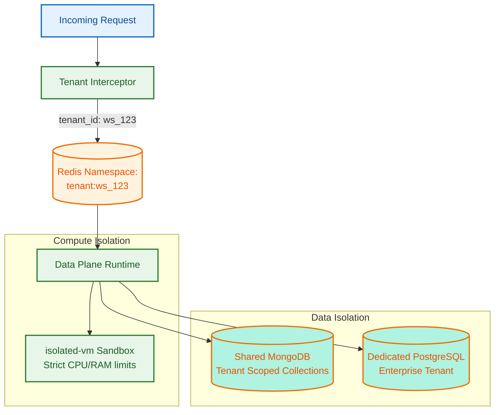
```mermaid
graph TD
    Req[Incoming Request] --> Interceptor[Tenant Interceptor]
    Interceptor --> |"tenant_id: ws_123"| Cache[(Redis Namespace: <br/> tenant:ws_123)]
    
    Cache --> Runtime[Data Plane Runtime]
    
    subgraph Compute Isolation
        Runtime --> V8[isolated-vm Sandbox <br/> Strict CPU/RAM limits]
    end
    
    subgraph Data Isolation
        Runtime --> DB1[(Shared MongoDB <br/> Tenant Scoped Collections)]
        Runtime --> DB2[(Dedicated PostgreSQL <br/> Enterprise Tenant)]
    end

	classDef incomingRequest fill:#E3F2FD,stroke:#1565C0,stroke-width:2px,color:#0D47A1;
    classDef engine fill:#E8F5E9,stroke:#2E7D32,stroke-width:2px,color:#1B5E20;
    classDef database fill:#FFF3E0,stroke:#EF6C00,stroke-width:2px,color:#E65100;
    classDef databaseIsolated fill:#AFF3E0,stroke:#EF6C00,stroke-width:2px,color:#E65100;

    class Req incomingRequest;
    class Interceptor,V8,Runtime engine;
    class Cache database;
	class DB1,DB2 databaseIsolated;
```

#### Isolation Strategy by Tier

mini-baas supports multiple isolation models and chooses among them deliberately rather than pretending one model fits every tenant:

| Model | Shape | Strength | Tradeoff | Best Fit |
|---|---|---|---|---|
| **Shared DB + Shared Schema** | One set of tables with `tenantId` filtering | Lowest infrastructure cost | Highest blast radius if filtering logic fails | Small/internal tenants only |
| **Shared DB + Separate Schemas** | One database, one schema per tenant | Stronger logical isolation | More schema orchestration overhead | Growing SaaS tenants |
| **Database per Tenant** | One database per tenant | Strong data isolation and easy export/delete | More operational and connection cost | Enterprise and regulated tenants |
| **Cluster/Namespace per Tenant** | Dedicated compute and network boundary | Strongest isolation | Highest cost and orchestration complexity | Premium isolation tiers |

The recommended production posture is hybrid:
- Small tenants use shared infrastructure with strict tenant scoping.
- Enterprise tenants use dedicated databases and, when required, dedicated compute boundaries.
- Cache keys are always tenant namespaced, for example `tenant:ws_123:entity:orders:page:1`.


### 4. Convention Over Configuration, Configuration Over Code

mini-baas ships with sensible defaults:
- bcrypt 12 rounds, 32-byte pepper, 256-bit JWT secret
- Default roles: `admin`, `user`, `moderator`
- Password policy: 8+ chars, requires uppercase, lowercase, digit, special
- Session TTL: 7 days
- Rate limit: 120 requests/minute

Everything is overridable per-tenant in the Master Document — without writing a line of code.

---

## High-Level Architecture

mini-baas follows a strict **three-plane architecture** inspired by [Kubernetes](https://kubernetes.io/docs/concepts/overview/components/) control plane / data plane separation:

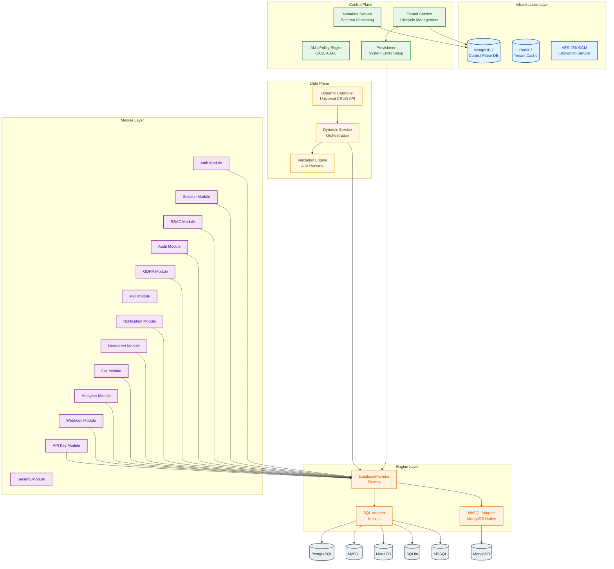
```mermaid
graph TB
    subgraph Infrastructure Layer
        direction TB
        INF_ANCHOR[ ]
        SYSDB[(MongoDB 7<br/>Control Plane DB)]
        CACHE[(Redis 7<br/>Tenant Cache)]
        CRYPTO[AES-256-GCM<br/>Encryption Service]
    end

    subgraph Control Plane
        direction TB
        CTRL_ANCHOR[ ]
        TENANT[Tenant Service<br/>Lifecycle Management]
        META[Metadata Service<br/>Schema Versioning]
        IAM[IAM / Policy Engine<br/>CASL ABAC]
        PROV[Provisioner<br/>System Entity Setup]
    end

    subgraph Engine Layer
        direction TB
        ENG_ANCHOR[ ]
        FACTORY[DatabaseProvider<br/>Factory]
        SQL[SQL Adapter<br/>Knex.js]
        NOSQL[NoSQL Adapter<br/>MongoDB Native]
    end

    subgraph Data Plane
        direction TB
        DATA_ANCHOR[ ]
        DYN[Dynamic Controller<br/>Universal CRUD API]
        VAL[Validation Engine<br/>AJV Runtime]
        SVC[Dynamic Service<br/>Orchestration]
    end

    subgraph Module Layer
        direction TB
        MOD_ANCHOR[ ]
        AUTH[Auth Module]
        SESS[Session Module]
        RBAC[RBAC Module]
        AUDIT[Audit Module]
        GDPR[GDPR Module]
        MAIL[Mail Module]
        NOTIF[Notification Module]
        NEWS[Newsletter Module]
        FILES[File Module]
        ANALYTICS[Analytics Module]
        WEBHOOK[Webhook Module]
        APIKEY[API Key Module]
        SEC[Security Module]
    end

    TENANT --> SYSDB
    META --> SYSDB
    TENANT --> PROV
    PROV --> FACTORY
    FACTORY --> SQL
    FACTORY --> NOSQL
    DYN --> SVC
    SVC --> VAL
    SVC --> FACTORY
    AUTH --> FACTORY
    SESS --> FACTORY
    RBAC --> FACTORY
    AUDIT --> FACTORY
    GDPR --> FACTORY
    NOTIF --> FACTORY
    NEWS --> FACTORY
    FILES --> FACTORY
    ANALYTICS --> FACTORY
    WEBHOOK --> FACTORY
    APIKEY --> FACTORY

    SQL --> PG[(PostgreSQL)]
    SQL --> MY[(MySQL)]
    SQL --> MA[(MariaDB)]
    SQL --> SL[(SQLite)]
    SQL --> MS[(MSSQL)]
    NOSQL --> MO[(MongoDB)]

    INF_ANCHOR ~~~ CTRL_ANCHOR
    CTRL_ANCHOR ~~~ DATA_ANCHOR
    DATA_ANCHOR ~~~ MOD_ANCHOR
    MOD_ANCHOR ~~~ ENG_ANCHOR

    MOD_ANCHOR ~~~ AUTH
    AUTH ~~~ SESS
    SESS ~~~ RBAC
    RBAC ~~~ AUDIT
    AUDIT ~~~ GDPR
    GDPR ~~~ MAIL
    MAIL ~~~ NOTIF
    NOTIF ~~~ NEWS
    NEWS ~~~ FILES
    FILES ~~~ ANALYTICS
    ANALYTICS ~~~ WEBHOOK
    WEBHOOK ~~~ APIKEY
    APIKEY ~~~ SEC

    classDef infra fill:#E3F2FD,stroke:#1565C0,stroke-width:2px,color:#0D47A1;
    classDef control fill:#E8F5E9,stroke:#2E7D32,stroke-width:2px,color:#1B5E20;
    classDef data fill:#FFF8E1,stroke:#F9A825,stroke-width:2px,color:#5D4037;
    classDef module fill:#F3E5F5,stroke:#8E24AA,stroke-width:2px,color:#4A148C;
    classDef engine fill:#FFF3E0,stroke:#EF6C00,stroke-width:2px,color:#E65100;
    classDef db fill:#ECEFF1,stroke:#546E7A,stroke-width:2px,color:#263238;

    class SYSDB,CACHE,CRYPTO infra;
    class TENANT,META,IAM,PROV control;
    class DYN,VAL,SVC data;
    class AUTH,SESS,RBAC,AUDIT,GDPR,MAIL,NOTIF,NEWS,FILES,ANALYTICS,WEBHOOK,APIKEY,SEC module;
    class FACTORY,SQL,NOSQL engine;
    class PG,MY,MA,SL,MS,MO db;

    classDef hidden fill:transparent,stroke:transparent,color:transparent;
    class INF_ANCHOR,CTRL_ANCHOR,ENG_ANCHOR,DATA_ANCHOR,MOD_ANCHOR hidden;
```

### The Three Planes

| Plane | Responsibility | Storage |
|---|---|---|
| **Control Plane** | Tenant lifecycle, schema management, provisioning, IAM policies | [MongoDB 7](https://www.mongodb.com/docs/) (system DB) |
| **Engine Layer** | Database abstraction, connection pooling, query translation | [Knex.js](https://knexjs.org/) + [MongoDB Node Driver](https://www.mongodb.com/docs/drivers/node/current/) |
| **Data Plane** | Dynamic API, validation, auth, sessions, all modules | Tenant's own database (any engine) |

### Control Plane Resilience Rule

Control Plane failure must not immediately break Data Plane execution for already-known tenants. That requires:
- Tenant metadata to be cached in Redis by tenant and version.
- Compiled policy snapshots to remain locally available for active tenants.
- Adapter connection settings to be cacheable and refreshable without re-provisioning.

This keeps governance centralized while preserving runtime availability when the metadata store is temporarily degraded.

### Caching Strategy

mini-baas uses three distinct caches, each tenant-scoped:
- **Metadata Cache** for the Master Document and activation state.
- **Compiled Validator Cache** for AJV validators keyed by `tenantId:entity:version`.
- **Query Result Cache** as an optional acceleration layer for read-heavy endpoints.

All cache entries are TTL-controlled, tenant namespaced, and invalidated on schema version changes.

---

## The Polyglot Engine — How It Works

The polyglot engine is the heart of mini-baas. It's a **translation pipeline** — an intermediate representation layer that allows every module to express database operations in a universal JSON format, which gets transpiled into engine-specific queries.

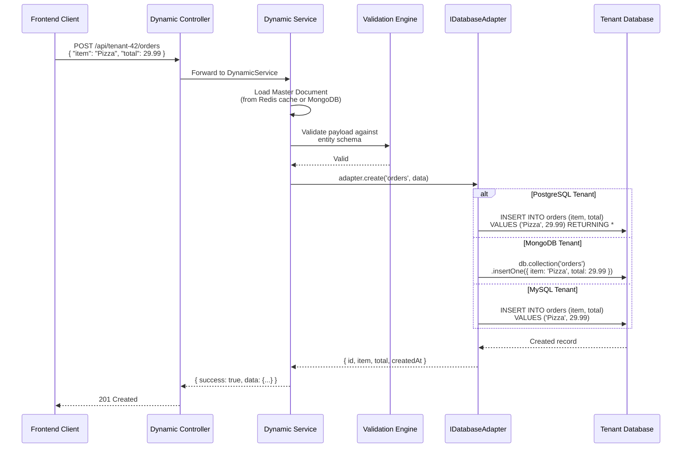
```mermaid
sequenceDiagram
    participant Client as Frontend Client
    participant API as Dynamic Controller
    participant SVC as Dynamic Service
    participant VAL as Validation Engine
    participant ADP as IDatabaseAdapter
    participant DB as Tenant Database

    Client->>API: POST /api/tenant-42/orders<br/>{ "item": "Pizza", "total": 29.99 }
    API->>SVC: Forward to DynamicService
    SVC->>SVC: Load Master Document<br/>(from Redis cache or MongoDB)
    SVC->>VAL: Validate payload against<br/>entity schema
    VAL-->>SVC: Valid
    SVC->>ADP: adapter.create('orders', data)

    alt PostgreSQL Tenant
        ADP->>DB: INSERT INTO orders (item, total)<br/>VALUES ('Pizza', 29.99) RETURNING *
    else MongoDB Tenant
        ADP->>DB: db.collection('orders')<br/>.insertOne({ item: 'Pizza', total: 29.99 })
    else MySQL Tenant
        ADP->>DB: INSERT INTO orders (item, total)<br/>VALUES ('Pizza', 29.99)
    end

    DB-->>ADP: Created record
    ADP-->>SVC: { id, item, total, createdAt }
    SVC-->>API: { success: true, data: {...} }
    API-->>Client: 201 Created
```

### The Universal Adapter Interface

Every database engine implements a single [TypeScript](https://www.typescriptlang.org/docs/) interface — `IDatabaseAdapter`:

```typescript
interface IDatabaseAdapter {
  readonly engine: string;

  // Lifecycle
  connect(config): Promise<void>;
  disconnect(): Promise<void>;
  ping(): Promise<boolean>;

  // CRUD — the universal operations
  findOne(collection, filter): Promise<Record<string, unknown> | null>;
  findMany(collection, options?): Promise<QueryResult>;
  create(collection, data): Promise<Record<string, unknown>>;
  update(collection, filter, data): Promise<Record<string, unknown>>;
  delete(collection, filter): Promise<boolean>;
  count(collection, filter?): Promise<number>;

  // Advanced
  executeQuery(query: QueryIR): Promise<QueryResult>;
  introspect(): Promise<UniversalSchemaMap>;

  // DDL (schema provisioning)
  collectionExists(name): Promise<boolean>;
  createCollection(name, schema): Promise<void>;
  dropCollection(name): Promise<void>;
  ensureIndexes(name, indexes): Promise<void>;
}
```

### The Universal Query IR

For complex queries (filtering, sorting, pagination, relations), mini-baas uses a **Query Intermediate Representation** — a JSON-based query language:

```json
{
  "entity": "orders",
  "where": {
    "status": { "$eq": "pending" },
    "total": { "$gt": 100 }
  },
  "include": ["customer", "items.product"],
  "orderBy": { "createdAt": "desc" },
  "limit": 20,
  "offset": 0,
  "select": ["id", "status", "total", "createdAt"]
}
```

This IR gets transpiled by each adapter:
- **SQL Adapter** → `SELECT id, status, total, created_at FROM orders WHERE status = 'pending' AND total > 100 ORDER BY created_at DESC LIMIT 20`
- **MongoDB Adapter** → `db.orders.aggregate([ { $match: { status: "pending", total: { $gt: 100 } } }, { $sort: { createdAt: -1 } }, { $limit: 20 } ])`

Same intent. Same result. Different engines.

### Universal Type System

Every database engine maps its native types to a universal set:

| Universal Type | PostgreSQL | MySQL | MongoDB | SQLite |
|---|---|---|---|---|
| `string` | `VARCHAR(255)` | `VARCHAR(255)` | `String` | `TEXT` |
| `text` | `TEXT` | `LONGTEXT` | `String` | `TEXT` |
| `integer` | `INTEGER` | `INT` | `Number (int32)` | `INTEGER` |
| `bigint` | `BIGINT` | `BIGINT` | `Number (long)` | `INTEGER` |
| `float` | `DOUBLE PRECISION` | `DOUBLE` | `Number (double)` | `REAL` |
| `decimal` | `NUMERIC(10,2)` | `DECIMAL(10,2)` | `Decimal128` | `REAL` |
| `boolean` | `BOOLEAN` | `TINYINT(1)` | `Boolean` | `INTEGER` |
| `datetime` | `TIMESTAMP` | `DATETIME` | `Date` | `TEXT` |
| `uuid` | `UUID` | `CHAR(36)` | `String` | `TEXT` |
| `json` | `JSONB` | `JSON` | `Object` | `TEXT` |
| `array` | `JSONB` | `JSON` | `Array` | `TEXT` |

### Consistency Guarantees

mini-baas must never promise guarantees stronger than the weakest supported engine can actually enforce.

| Feature | SQL Engines | MongoDB | Platform Guarantee |
|---|---|---|---|
| Transactions | ACID | Limited / scope-dependent | Best effort, adapter-aware |
| Strong consistency | Yes | Yes for single-document operations | Engine-dependent |
| Cross-engine joins | Native within one SQL engine | Not applicable in the same way | Not supported across engines |

This is why the abstraction layer expresses intent, not impossible uniformity. Relational joins, multi-entity transactions, and strict consistency rules are exposed only where the target engine can honor them.

---

## The Master Document — A Tenant's DNA

Every tenant is defined by a single **Master Document** stored in the Control Plane's MongoDB. This document is the complete blueprint for a tenant's backend — no code required.

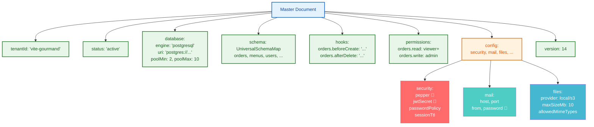
```mermaid
graph TD
    MD[Master Document]

    MD --> ID[tenantId: 'vite-gourmand']
    MD --> STATUS[status: 'active']
    MD --> DB_CFG[database:<br/>engine: 'postgresql'<br/>uri: 'postgres://...'<br/>poolMin: 2, poolMax: 10]
    MD --> SCHEMA[schema: UniversalSchemaMap<br/>orders, menus, users, ...]
    MD --> HOOKS[hooks:<br/>orders.beforeCreate: '...'<br/>orders.afterDelete: '...']
    MD --> PERMS[permissions:<br/>orders.read: viewer+<br/>orders.write: admin]
    MD --> CONFIG[config:<br/>security, mail, files, ...]
    MD --> VERSION[version: 14]

    CONFIG --> SEC[security:<br/>pepper 🔐<br/>jwtSecret 🔐<br/>passwordPolicy<br/>sessionTtl]
    CONFIG --> MAIL_CFG[mail:<br/>host, port<br/>from, password 🔐]
    CONFIG --> FILE_CFG[files:<br/>provider: local/s3<br/>maxSizeMb: 10<br/>allowedMimeTypes]

    style SEC fill:#ff6b6b,color:#fff
    style MAIL_CFG fill:#4ecdc4,color:#fff
    style FILE_CFG fill:#45b7d1,color:#fff

    classDef root fill:#E3F2FD,stroke:#1565C0,stroke-width:2px,color:#0D47A1;
    classDef metadata fill:#E8F5E9,stroke:#2E7D32,stroke-width:2px,color:#1B5E20;
    classDef configHub fill:#FFF3E0,stroke:#EF6C00,stroke-width:2px,color:#E65100;
    classDef sensitive fill:#FDECEA,stroke:#C62828,stroke-width:2px,color:#7F1D1D;
    classDef mail fill:#E0F7FA,stroke:#00838F,stroke-width:2px,color:#004D40;
    classDef files fill:#EDE7F6,stroke:#5E35B1,stroke-width:2px,color:#311B92;

    class MD root;
    class ID,STATUS,DB_CFG,SCHEMA,HOOKS,PERMS,VERSION metadata;
    class CONFIG configHub;
```

### Structure

```typescript
interface MasterDocument {
  tenantId: string;              // 'vite-gourmand'
  status: TenantStatus;          // 'active' | 'suspended' | 'provisioning' | 'archived'
  name: string;                  // 'Vite Gourmand Restaurant'
  database: TenantDatabaseConfig; // engine + URI + pool config
  schema: UniversalSchemaMap;    // All entity definitions
  hooks: Record<string, TenantHooks>;        // Lifecycle hooks
  permissions: Record<string, EntityPermissions>; // ABAC rules
  config: TenantConfig;          // Security, mail, files, etc.
  version: number;               // Schema version (auto-incremented)
  createdAt: Date;
  updatedAt: Date;
}
```

### Why MongoDB for the Control Plane?

| Requirement | MongoDB | PostgreSQL + JSONB |
|---|---|---|
| Deeply nested, schema-variable JSON | ✅ Native | ⚠️ Technically possible, loses ergonomics |
| Native change streams for live updates | ✅ Built-in | ❌ Requires LISTEN/NOTIFY + polling |
| JSON Schema validation at DB level | ✅ db.createCollection with validator | ❌ CHECK constraints only |
| Flexible indexing on nested fields | ✅ Dot notation indexes | ⚠️ GIN indexes on JSONB |
| Document-shaped metadata queries | ✅ `{ 'config.security.pepper': { $exists: true } }` | ⚠️ `WHERE config->'security'->'pepper' IS NOT NULL` |

The Master Document is inherently document-shaped. Using MongoDB for it is not a preference — it's the correct tool.

---

## System Entity Model

When a tenant is activated, mini-baas auto-provisions **16 system entities** in the tenant's own database. These are prefixed `_baas_` to isolate them from business data (your `orders`, `products`, `menus`).

Split into three focused ER diagrams for readability.

### System Entities (1/3) - Identity and Access

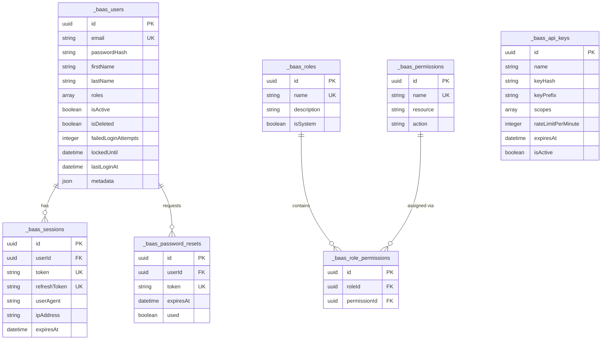
```mermaid
erDiagram
    _baas_users ||--o{ _baas_sessions : "has"
    _baas_users ||--o{ _baas_password_resets : "requests"
    _baas_roles ||--o{ _baas_role_permissions : "contains"
    _baas_permissions ||--o{ _baas_role_permissions : "assigned via"

    _baas_users {
        uuid id PK
        string email UK
        string passwordHash
        string firstName
        string lastName
        array roles
        boolean isActive
        boolean isDeleted
        integer failedLoginAttempts
        datetime lockedUntil
        datetime lastLoginAt
        json metadata
    }

    _baas_sessions {
        uuid id PK
        uuid userId FK
        string token UK
        string refreshToken UK
        string userAgent
        string ipAddress
        datetime expiresAt
    }

    _baas_password_resets {
        uuid id PK
        uuid userId FK
        string token UK
        datetime expiresAt
        boolean used
    }

    _baas_roles {
        uuid id PK
        string name UK
        string description
        boolean isSystem
    }

    _baas_permissions {
        uuid id PK
        string name UK
        string resource
        string action
    }

    _baas_role_permissions {
        uuid id PK
        uuid roleId FK
        uuid permissionId FK
    }

    _baas_api_keys {
        uuid id PK
        string name
        string keyHash
        string keyPrefix
        array scopes
        integer rateLimitPerMinute
        datetime expiresAt
        boolean isActive
    }
```

### System Entities (2/3) - Activity and Compliance

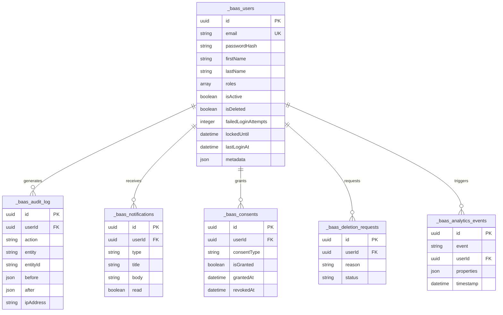
```mermaid
erDiagram
    _baas_users ||--o{ _baas_audit_log : "generates"
    _baas_users ||--o{ _baas_notifications : "receives"
    _baas_users ||--o{ _baas_consents : "grants"
    _baas_users ||--o{ _baas_deletion_requests : "requests"
    _baas_users ||--o{ _baas_analytics_events : "triggers"

    _baas_users {
        uuid id PK
        string email UK
        string passwordHash
        string firstName
        string lastName
        array roles
        boolean isActive
        boolean isDeleted
        integer failedLoginAttempts
        datetime lockedUntil
        datetime lastLoginAt
        json metadata
    }

    _baas_audit_log {
        uuid id PK
        uuid userId FK
        string action
        string entity
        string entityId
        json before
        json after
        string ipAddress
    }

    _baas_consents {
        uuid id PK
        uuid userId FK
        string consentType
        boolean isGranted
        datetime grantedAt
        datetime revokedAt
    }

    _baas_notifications {
        uuid id PK
        uuid userId FK
        string type
        string title
        string body
        boolean read
    }

    _baas_analytics_events {
        uuid id PK
        string event
        uuid userId FK
        json properties
        datetime timestamp
    }

    _baas_deletion_requests {
        uuid id PK
        uuid userId FK
        string reason
        string status
    }
```

### System Entities (3/3) - Files, Webhooks, and Messaging

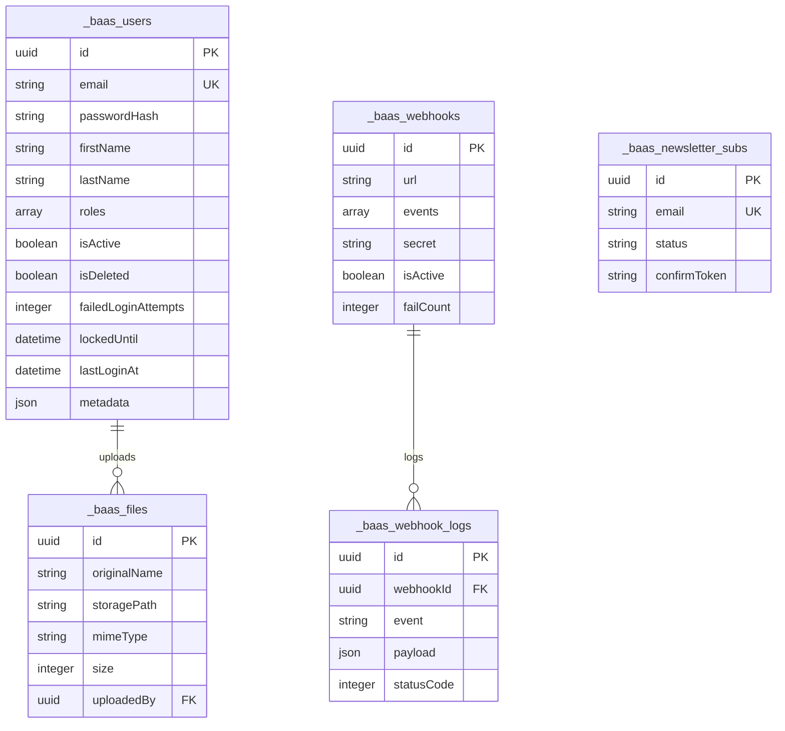
```mermaid
erDiagram
    _baas_users ||--o{ _baas_files : "uploads"
    _baas_webhooks ||--o{ _baas_webhook_logs : "logs"

    _baas_users {
        uuid id PK
        string email UK
        string passwordHash
        string firstName
        string lastName
        array roles
        boolean isActive
        boolean isDeleted
        integer failedLoginAttempts
        datetime lockedUntil
        datetime lastLoginAt
        json metadata
    }

    _baas_files {
        uuid id PK
        string originalName
        string storagePath
        string mimeType
        integer size
        uuid uploadedBy FK
    }

    _baas_webhooks {
        uuid id PK
        string url
        array events
        string secret
        boolean isActive
        integer failCount
    }

    _baas_webhook_logs {
        uuid id PK
        uuid webhookId FK
        string event
        json payload
        integer statusCode
    }

    _baas_newsletter_subs {
        uuid id PK
        string email UK
        string status
        string confirmToken
    }
```

### Provisioning Flow

When `POST /control-plane/tenants/:id/activate` is called:

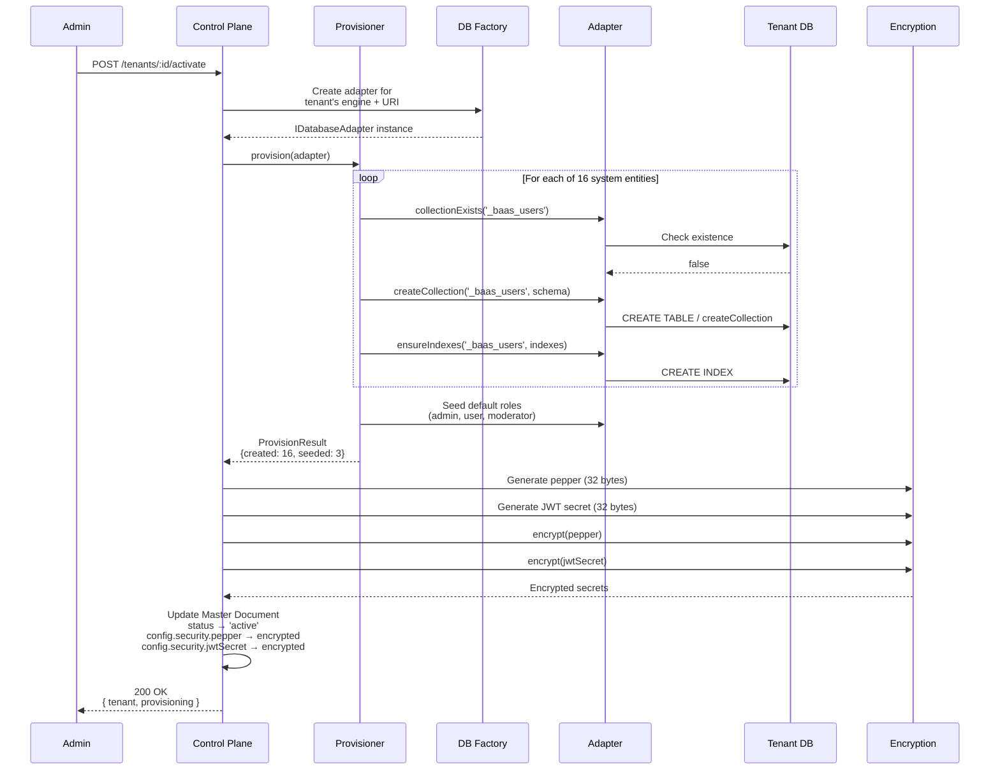
```mermaid
sequenceDiagram
    participant Admin
    participant CP as Control Plane
    participant PROV as Provisioner
    participant FACTORY as DB Factory
    participant ADP as Adapter
    participant DB as Tenant DB
    participant CRYPTO as Encryption

    Admin->>CP: POST /tenants/:id/activate
    CP->>FACTORY: Create adapter for<br/>tenant's engine + URI
    FACTORY-->>CP: IDatabaseAdapter instance
    CP->>PROV: provision(adapter)

    loop For each of 16 system entities
        PROV->>ADP: collectionExists('_baas_users')
        ADP->>DB: Check existence
        DB-->>ADP: false
        PROV->>ADP: createCollection('_baas_users', schema)
        ADP->>DB: CREATE TABLE / createCollection
        PROV->>ADP: ensureIndexes('_baas_users', indexes)
        ADP->>DB: CREATE INDEX
    end

    PROV->>ADP: Seed default roles<br/>(admin, user, moderator)
    PROV-->>CP: ProvisionResult<br/>{created: 16, seeded: 3}

    CP->>CRYPTO: Generate pepper (32 bytes)
    CP->>CRYPTO: Generate JWT secret (32 bytes)
    CP->>CRYPTO: encrypt(pepper)
    CP->>CRYPTO: encrypt(jwtSecret)
    CRYPTO-->>CP: Encrypted secrets

    CP->>CP: Update Master Document<br/>status → 'active'<br/>config.security.pepper → encrypted<br/>config.security.jwtSecret → encrypted

    CP-->>Admin: 200 OK<br/>{ tenant, provisioning }
```

The provisioner is **idempotent** — safe to re-run. It skips entities that already exist and only creates missing ones.

---

## Module Inventory

mini-baas ships with **14 universal modules** — every module talks exclusively to `IDatabaseAdapter`, never to a specific database engine.

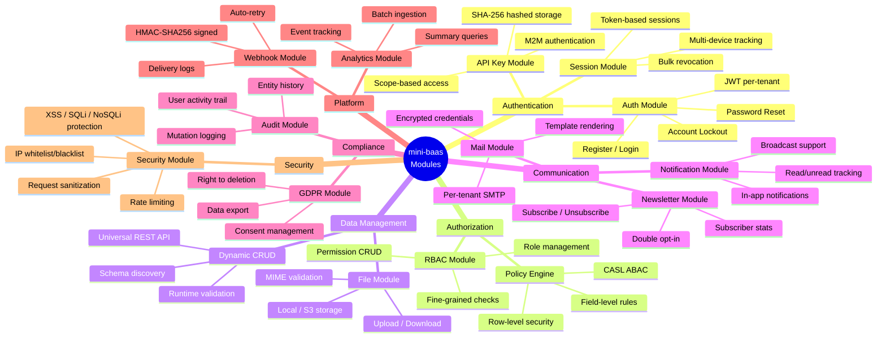
```mermaid
mindmap
  root((mini-baas<br/>Modules))
    Authentication
      Auth Module
        Register / Login
        JWT per-tenant
        Password Reset
        Account Lockout
      Session Module
        Token-based sessions
        Multi-device tracking
        Bulk revocation
      API Key Module
        M2M authentication
        Scope-based access
        SHA-256 hashed storage
    Authorization
      RBAC Module
        Role management
        Permission CRUD
        Fine-grained checks
      Policy Engine
        CASL ABAC
        Field-level rules
        Row-level security
    Data Management
      Dynamic CRUD
        Universal REST API
        Runtime validation
        Schema discovery
      File Module
        Upload / Download
        MIME validation
        Local / S3 storage
    Communication
      Mail Module
        Per-tenant SMTP
        Template rendering
        Encrypted credentials
      Notification Module
        In-app notifications
        Read/unread tracking
        Broadcast support
      Newsletter Module
        Double opt-in
        Subscribe / Unsubscribe
        Subscriber stats
    Compliance
      Audit Module
        Mutation logging
        Entity history
        User activity trail
      GDPR Module
        Consent management
        Data export
        Right to deletion
    Platform
      Analytics Module
        Event tracking
        Batch ingestion
        Summary queries
      Webhook Module
        HMAC-SHA256 signed
        Delivery logs
        Auto-retry
    Security
      Security Module
        IP whitelist/blacklist
        Rate limiting
        Request sanitization
        XSS / SQLi / NoSQLi protection
```

### Module Details

#### Auth Module (`/api/:tenantId/auth/*`)

| Endpoint | Auth | Description |
|---|---|---|
| `POST /register` | Public | Create account with email/password |
| `POST /login` | Public | Authenticate, receive JWT + refresh token |
| `POST /refresh` | Public | Exchange refresh token for new access token |
| `GET /me` | JWT | Get current user profile |
| `POST /forgot-password` | Public | Request password reset email |
| `POST /reset-password` | Public | Reset password with token |
| `POST /change-password` | JWT | Change password (requires current) |

**Security layers:**
- bcrypt with **12 salt rounds** + **per-tenant pepper** (encrypted at rest)
- Per-tenant JWT secrets (AES-256-GCM encrypted in Master Document)
- Account lockout after N failed attempts (configurable)
- Password policy enforcement (length, complexity)

#### Session Module

- Token-based sessions stored in `_baas_sessions`
- Multi-device tracking (user agent, IP address)
- Automatic expiry (configurable TTL per tenant)
- Bulk revocation ("log out everywhere")
- Session refresh/extension

#### RBAC Module (`/api/:tenantId/roles/*`)

- Three default roles seeded at provisioning: `admin`, `user`, `moderator`
- Fine-grained permissions: `resource:action` pairs (e.g., `orders:read`, `users:delete`)
- `@Roles('admin')` decorator for role-based route protection
- `@RequirePermission('orders', 'read')` for fine-grained checks
- `admin` role bypasses all permission checks

#### GDPR Module (`/api/:tenantId/gdpr/*`)

| Endpoint | Auth | Description |
|---|---|---|
| `POST /consent` | JWT | Grant a consent type |
| `DELETE /consent/:type` | JWT | Revoke a consent |
| `GET /consents` | JWT | List user's consents |
| `GET /export` | JWT | Export all personal data (JSON) |
| `POST /deletion-request` | JWT | Request account deletion |
| `POST /deletion-request/:id/process` | Admin | Process deletion (anonymize + purge) |

**Deletion process:** Anonymizes user record (`email → deleted-{uuid}@anonymized.local`), deletes sessions, deletes consents and notifications, anonymizes audit trail entries, marks request as completed.

#### Audit Module

Every mutation in the system is logged to `_baas_audit_log` with:
- Who (userId), What (action, entity, entityId), When (timestamp)
- Before/After snapshots of the data
- IP address and user agent

Admin endpoints for querying audit trail by date range, user, entity, or action.

#### Mail Module

- Per-tenant SMTP configuration (host, port, credentials encrypted at rest)
- Transporter caching (one nodemailer transporter per tenant, reused across requests)
- Global SMTP fallback from environment variables
- Template system for password reset, welcome, newsletter confirmation emails

#### Notification Module (`/api/:tenantId/notifications/*`)

| Endpoint | Auth | Description |
|---|---|---|
| `GET /` | JWT | List notifications (paginated) |
| `GET /unread-count` | JWT | Count unread notifications |
| `PATCH /:id/read` | JWT | Mark single as read |
| `PATCH /read-all` | JWT | Mark all as read |
| `DELETE /:id` | JWT | Delete notification |

#### Newsletter Module (`/api/:tenantId/newsletter/*`)

- Double opt-in flow: subscribe → confirmation email → confirm token → active
- Unsubscribe by token (one-click from email) or by email
- Admin: list subscribers, view stats (active/pending/unsubscribed)

#### File Module

- Metadata stored in `_baas_files` via adapter (polyglot)
- Binary storage: local filesystem (dev) or S3-compatible (prod)
- MIME type validation against tenant-configured allowlist
- File size enforcement (configurable per tenant)

#### Analytics Module (`/api/:tenantId/analytics/*`)

- Event tracking: `{ event: 'page_view', userId, properties, timestamp }`
- Batch ingestion for high-throughput scenarios
- Query and filter events by type, date range, user
- Summary aggregations (count by event type)

#### Webhook Module (`/api/:tenantId/webhooks/*`)

- Register webhook URLs with event subscriptions
- HMAC-SHA256 signed payloads (`X-Webhook-Signature` header)
- Delivery logs with status codes, response bodies, durations
- Automatic deactivation after consecutive failures
- Test dispatch endpoint for debugging

#### API Key Module (`/api/:tenantId/api-keys/*`)

- Key format: `baas_sk_<64-char-hex>` (shown once at creation)
- SHA-256 hashed for storage (the raw key is never stored)
- Scope-based access control (`@RequireScopes('analytics:write')`)
- `x-api-key` header authentication as alternative to JWT
- Expiration dates and rate limit per key

#### Security Module (Global)

- **IP Filter Guard**: Per-tenant IP whitelist/blacklist with CIDR support
- **Rate Limiter**: Sliding window counter, per-tenant + per-user/IP keying, `X-RateLimit-*` response headers
- **Sanitization Guard**: Blocks NoSQL injection (`$gt`, `$where`), SQL injection patterns, prototype pollution (`__proto__`, `constructor`), XSS vectors (`<script>`). Registered globally.
- **Security Headers Middleware**: `X-Frame-Options: DENY`, `X-Content-Type-Options: nosniff`, `Referrer-Policy`, `Permissions-Policy` (camera, microphone, geolocation, payment all denied)
- **Helmet**: CSP, HSTS, and other HTTP security headers (via main.ts)
- **Compression**: gzip response compression
- **Cookie Parser**: Secure cookie handling

---

## Security Architecture

Security in mini-baas is **defense in depth** — multiple independent layers, each providing protection even if another fails.

Reference baselines: [OWASP Cheat Sheet Series](https://cheatsheetseries.owasp.org/), [OWASP ASVS](https://owasp.org/www-project-application-security-verification-standard/), and [NIST CSRC](https://csrc.nist.gov/).

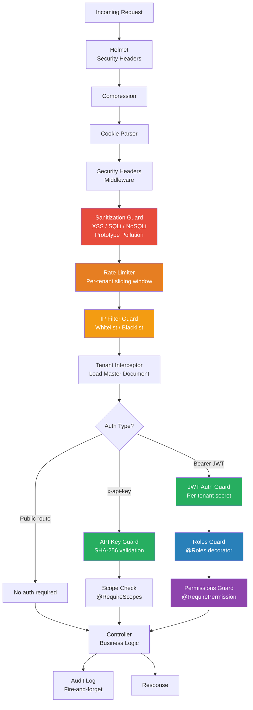
```mermaid
graph TD
    REQ[Incoming Request] --> HELMET[Helmet<br/>Security Headers]
    HELMET --> COMPRESS[Compression]
    COMPRESS --> COOKIE[Cookie Parser]
    COOKIE --> HEADERS[Security Headers<br/>Middleware]
    HEADERS --> SANITIZE[Sanitization Guard<br/>XSS / SQLi / NoSQLi<br/>Prototype Pollution]
    SANITIZE --> THROTTLE[Rate Limiter<br/>Per-tenant sliding window]
    THROTTLE --> IPCHECK[IP Filter Guard<br/>Whitelist / Blacklist]
    IPCHECK --> TENANT[Tenant Interceptor<br/>Load Master Document]
    TENANT --> AUTH_CHECK{Auth Type?}

    AUTH_CHECK -->|Bearer JWT| JWT[JWT Auth Guard<br/>Per-tenant secret]
    AUTH_CHECK -->|x-api-key| APIKEY_G[API Key Guard<br/>SHA-256 validation]
    AUTH_CHECK -->|Public route| PUBLIC[No auth required]

    JWT --> ROLES[Roles Guard<br/>@Roles decorator]
    APIKEY_G --> SCOPES[Scope Check<br/>@RequireScopes]
    PUBLIC --> CONTROLLER

    ROLES --> PERMS[Permissions Guard<br/>@RequirePermission]
    SCOPES --> CONTROLLER
    PERMS --> CONTROLLER

    CONTROLLER[Controller<br/>Business Logic]
    CONTROLLER --> AUDIT_LOG[Audit Log<br/>Fire-and-forget]
    CONTROLLER --> RESPONSE[Response]

    style SANITIZE fill:#e74c3c,color:#fff
    style THROTTLE fill:#e67e22,color:#fff
    style IPCHECK fill:#f39c12,color:#fff
    style JWT fill:#27ae60,color:#fff
    style APIKEY_G fill:#27ae60,color:#fff
    style ROLES fill:#2980b9,color:#fff
    style PERMS fill:#8e44ad,color:#fff
```

### Encryption at Rest

| Secret | Algorithm | Key Source |
|---|---|---|
| User passwords | bcrypt (12 rounds) + per-tenant pepper | Pepper generated at provisioning |
| Per-tenant pepper | AES-256-GCM | `MASTER_ENCRYPTION_KEY` env var |
| Per-tenant JWT secret | AES-256-GCM | `MASTER_ENCRYPTION_KEY` env var |
| Mail SMTP passwords | AES-256-GCM | `MASTER_ENCRYPTION_KEY` env var |
| API keys | SHA-256 (one-way hash) | N/A |
| Webhook signing secrets | HMAC-SHA256 | Per-webhook random secret |

### Password Hashing Pipeline

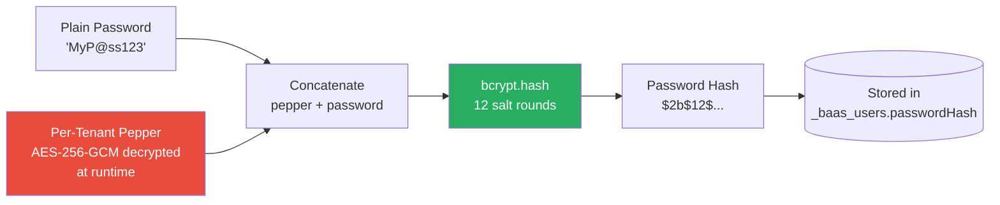
```mermaid
graph LR
    PLAIN[Plain Password<br/>'MyP@ss123'] --> CONCAT[Concatenate<br/>pepper + password]
    PEPPER[Per-Tenant Pepper<br/>AES-256-GCM decrypted<br/>at runtime] --> CONCAT
    CONCAT --> BCRYPT[bcrypt.hash<br/>12 salt rounds]
    BCRYPT --> HASH[Password Hash<br/>$2b$12$...]
    HASH --> DB[(Stored in<br/>_baas_users.passwordHash)]

    style PEPPER fill:#e74c3c,color:#fff
    style BCRYPT fill:#27ae60,color:#fff
```

**Why pepper + bcrypt?**
- **bcrypt** provides salting (unique per hash) and computational cost (12 rounds ≈ 250ms)
- **Per-tenant pepper** means that even if a tenant's database is fully compromised, the attacker cannot crack passwords without *also* compromising the Control Plane's encrypted config
- **AES-256-GCM** encryption of the pepper means even Control Plane DB access isn't enough — you need the `MASTER_ENCRYPTION_KEY`

This creates a **three-layer protection**: database → encrypted pepper → master key.

### JWT Isolation

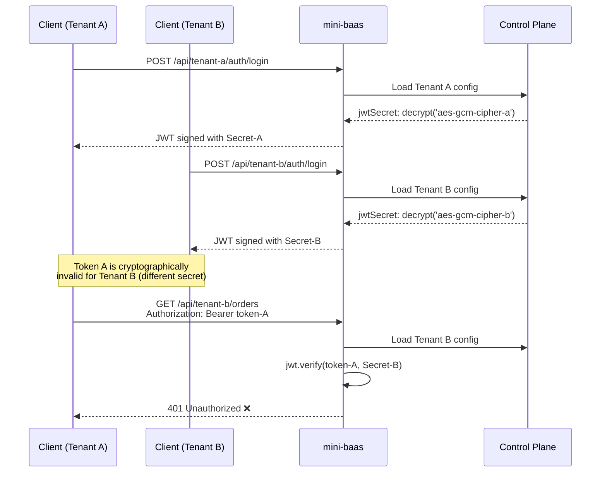
```mermaid
sequenceDiagram
    participant ClientA as Client (Tenant A)
    participant ClientB as Client (Tenant B)
    participant API as mini-baas
    participant CP as Control Plane

    ClientA->>API: POST /api/tenant-a/auth/login
    API->>CP: Load Tenant A config
    CP-->>API: jwtSecret: decrypt('aes-gcm-cipher-a')
    API-->>ClientA: JWT signed with Secret-A

    ClientB->>API: POST /api/tenant-b/auth/login
    API->>CP: Load Tenant B config
    CP-->>API: jwtSecret: decrypt('aes-gcm-cipher-b')
    API-->>ClientB: JWT signed with Secret-B

    Note over ClientA,ClientB: Token A is cryptographically<br/>invalid for Tenant B (different secret)

    ClientA->>API: GET /api/tenant-b/orders<br/>Authorization: Bearer token-A
    API->>CP: Load Tenant B config
    API->>API: jwt.verify(token-A, Secret-B)
    API-->>ClientA: 401 Unauthorized ❌
```

---

## Request Lifecycle

Every request to the Data Plane follows this pipeline:

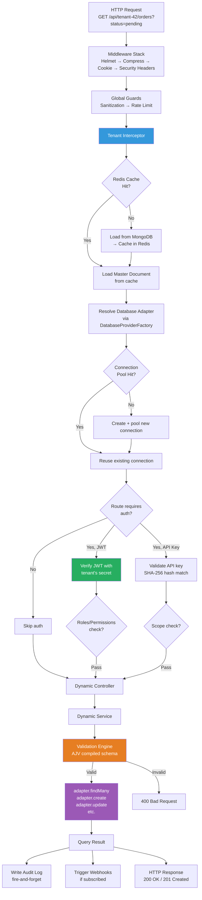
```mermaid
flowchart TD
    REQ[HTTP Request<br/>GET /api/tenant-42/orders?status=pending] --> MW[Middleware Stack<br/>Helmet → Compress → Cookie → Security Headers]
    MW --> GUARD[Global Guards<br/>Sanitization → Rate Limit]
    GUARD --> INTERCEPT[Tenant Interceptor]

    INTERCEPT --> CACHE{Redis Cache<br/>Hit?}
    CACHE -->|Yes| CTX_CACHED[Load Master Document<br/>from cache]
    CACHE -->|No| MONGO[Load from MongoDB<br/>→ Cache in Redis]
    MONGO --> CTX_CACHED

    CTX_CACHED --> ADAPTER[Resolve Database Adapter<br/>via DatabaseProviderFactory]
    ADAPTER --> POOL{Connection<br/>Pool Hit?}
    POOL -->|Yes| REUSE[Reuse existing connection]
    POOL -->|No| CONNECT[Create + pool new connection]
    CONNECT --> REUSE

    REUSE --> AUTH{Route requires<br/>auth?}
    AUTH -->|Yes, JWT| JWT_V[Verify JWT with<br/>tenant's secret]
    AUTH -->|Yes, API Key| AK_V[Validate API key<br/>SHA-256 hash match]
    AUTH -->|No| SKIP_AUTH[Skip auth]

    JWT_V --> RBAC_CHECK{Roles/Permissions<br/>check?}
    AK_V --> SCOPE_CHECK{Scope check?}
    SKIP_AUTH --> CONTROLLER

    RBAC_CHECK -->|Pass| CONTROLLER
    SCOPE_CHECK -->|Pass| CONTROLLER

    CONTROLLER[Dynamic Controller] --> SERVICE[Dynamic Service]
    SERVICE --> VALIDATE[Validation Engine<br/>AJV compiled schema]
    VALIDATE -->|Valid| EXEC[adapter.findMany<br/>adapter.create<br/>adapter.update<br/>etc.]
    VALIDATE -->|Invalid| ERR_400[400 Bad Request]

    EXEC --> RESULT[Query Result]
    RESULT --> AUDIT_W[Write Audit Log<br/>fire-and-forget]
    RESULT --> WEBHOOK_T[Trigger Webhooks<br/>if subscribed]
    RESULT --> RESPONSE[HTTP Response<br/>200 OK / 201 Created]

    style INTERCEPT fill:#3498db,color:#fff
    style JWT_V fill:#27ae60,color:#fff
    style VALIDATE fill:#e67e22,color:#fff
    style EXEC fill:#9b59b6,color:#fff
```

### Tenant-Aware Observability

Observability is part of the platform contract, not an afterthought.

**Metrics captured per tenant:**
- p95 latency
- error rate
- query volume
- storage usage

**Structured log fields on every request path:**
- `tenantId`
- `requestId`
- `correlationId`
- `schemaVersion`
- `adapterType`

Distributed tracing should be treated as mandatory from the beginning for request paths that cross API handlers, queues, hooks, and database calls.

This allows debugging, SLO tracking, and cost attribution at tenant granularity rather than only at process or cluster level.

### Failure Domain Rules

mini-baas is intentionally designed so that failures stay local whenever possible:
- A tenant database outage should affect only that tenant.
- A hook crash must not crash the worker or API process.
- Control Plane downtime should not break tenants already present in cache.
- Redis loss should degrade performance and rate-limit precision before it degrades correctness.

---

## Technology Stack

### Runtime & Framework

| Component | Technology | Version | Purpose |
|---|---|---|---|
| Runtime | [Node.js](https://nodejs.org/docs/latest/api/) | 22 LTS | JavaScript/TypeScript runtime |
| Framework | [NestJS](https://docs.nestjs.com/) | 11 | DDD-oriented, modular backend framework |
| Language | [TypeScript](https://www.typescriptlang.org/docs/) | 5.x | Static typing, interfaces, decorators |

### Database Layer

| Component | Technology | Purpose |
|---|---|---|
| SQL Adapter | [Knex.js](https://knexjs.org/) 3 | Query builder for PostgreSQL, MySQL, MariaDB, SQLite, MSSQL |
| NoSQL Adapter | [MongoDB Node Driver](https://www.mongodb.com/docs/drivers/node/current/) 6 | Direct access for MongoDB tenants |
| Control Plane DB | [Mongoose](https://mongoosejs.com/docs/) 8 + [MongoDB](https://www.mongodb.com/docs/) 7 | Master Document storage |
| Cache | [ioredis](https://github.com/redis/ioredis) + [Redis](https://redis.io/docs/latest/) 7 | Tenant metadata caching, rate limit state |

### Security

| Component | Technology | Purpose |
|---|---|---|
| Password Hashing | [bcrypt](https://github.com/kelektiv/node.bcrypt.js) 6 | 12-round salted hashing |
| Encryption | [Node.js `crypto`](https://nodejs.org/api/crypto.html) (AES-256-GCM) | Per-tenant secret encryption |
| JWT | [@nestjs/jwt](https://github.com/nestjs/jwt) 11 | Per-tenant token signing/verification |
| Authorization | [CASL](https://casl.js.org/) 6 | Attribute-based access control (ABAC) |
| Validation | [AJV](https://ajv.js.org/) 8 | Runtime JSON Schema validation |
| HTTP Security | [Helmet](https://helmetjs.github.io/) 8 | Security headers (CSP, HSTS, etc.) |

### Infrastructure

| Component | Technology | Purpose |
|---|---|---|
| Containerization | [Docker](https://docs.docker.com/) + [Docker Compose](https://docs.docker.com/compose/) | Development & deployment |
| Email | [nodemailer](https://nodemailer.com/) 8 | Per-tenant SMTP |
| Task Scheduling | [@nestjs/schedule](https://docs.nestjs.com/techniques/task-scheduling) | Periodic cleanup jobs |
| Event Bus | [@nestjs/event-emitter](https://github.com/nestjs/event-emitter) | Internal event-driven communication |
| Rate Limiting | [@nestjs/throttler](https://docs.nestjs.com/security/rate-limiting) + custom guard | Global + per-tenant rate limits |
| API Docs | [Swagger](https://swagger.io/specification/) / [OpenAPI](https://www.openapis.org/) | Auto-generated API documentation |

### Development Stack Containers

```
┌─────────────────────────────────────────────────────┐
│  Docker Compose Development Stack                   │
├──────────────┬──────────────────────────────────────┤
│  mongodb     │  MongoDB 7 (Control Plane)    :27017 │
│  db          │  PostgreSQL 16 (Default SQL)  :5432  │
│  redis       │  Redis 7 (Cache + Pub/Sub)    :6379  │
│  mailpit     │  Mailpit (Email catcher)      :8025  │
│  dev         │  NestJS BaaS Engine           :3000  │
└──────────────┴──────────────────────────────────────┘
```

---

## Implementation Phases

The entire engine was built in 10 phases, each verified with `tsc --noEmit` (zero errors) at completion.


```mermaid
gantt
    title mini-baas Implementation Roadmap
    dateFormat  X
    axisFormat %s

    section Foundation
    Phase 0 - DDD Structure & Prisma Removal           :done, p0, 0, 1
    Phase 1 - Control Plane (MongoDB + Tenants)         :done, p1, 1, 2
    Phase 2 - Polyglot Engine (Adapters + Factory)      :done, p2, 2, 3
    Phase 3 - Dynamic API (Single Controller)           :done, p3, 3, 4
    Phase 4 - Validation Engine (AJV Runtime)           :done, p4, 4, 5
    Phase 5 - ABAC Authorization (CASL Policies)        :done, p5, 5, 6

    section Modules Build
    DDL Extension + Provisioner + Crypto                :done, m1, 6, 7
    Auth Core (Password + JWT + Identity)               :done, m2, 7, 8
    Sessions + RBAC                                     :done, m3, 8, 9
    GDPR + Audit Trail                                  :done, m4, 9, 10
    Mail + Notifications + Newsletter                   :done, m5, 10, 11
    Files + Analytics + Webhooks + API Keys             :done, m6, 11, 12
    Security Hardening                                  :done, m7, 12, 13

    section Future
    Hook Sandbox (isolated-vm)                          :f1, 13, 14
    Background Jobs (BullMQ)                            :f2, 14, 15
    Billing + Usage Metering                            :f3, 15, 16
    First Tenant Migration (Vite Gourmand)              :f4, 16, 17
```

### Phase 0: Repository Reset & DDD Structure

- Restructured `src/` into DDD boundaries: `common/`, `modules/control-plane/`, `modules/data-plane/`, `modules/engines/`, `infrastructure/`
- Removed Prisma entirely (`@prisma/client`, prisma directory, `prisma.service.ts`)
- Installed: `knex`, `pg`, `mysql2`, `better-sqlite3`, `tedious`, `mongodb`, `mongoose`, `ioredis`, `bcrypt`, `@casl/ability`, `ajv`
- Removed static `users/` module (contradicts dynamic model)

### Phase 1: Control Plane

- MongoDB + Mongoose connection via `SystemDbModule`
- `TenantMetadata` Mongoose schema (the Master Document)
- `TenantService` — full lifecycle: create, read, update, suspend, archive, activate, delete
- `MetadataService` — schema CRUD with automatic version incrementing and rollback support
- `SchemaVersion` tracking for history
- Docker Compose with MongoDB 7, PostgreSQL 16, Redis 7, Mailpit

### Phase 2: Universal Adapter Layer

- `IDatabaseAdapter` interface — the universal contract (CRUD + DDL + introspection)
- `SqlAdapter` (806 lines) — Knex.js covering PostgreSQL, MySQL, MariaDB, SQLite, MSSQL
- `MongoAdapter` (647 lines) — MongoDB native driver with aggregation pipeline support
- `DatabaseProviderFactory` — request-scoped adapter resolution with connection pooling
- `UniversalSchemaMap`, `EntityDefinition`, `FieldDefinition` type system
- `QueryIR` — universal query intermediate representation

	Even though we only use MongoDB initially, we strictly enforce the `IDatabaseDriver` interface. The system *believes* it is using an agnostic adapter. 

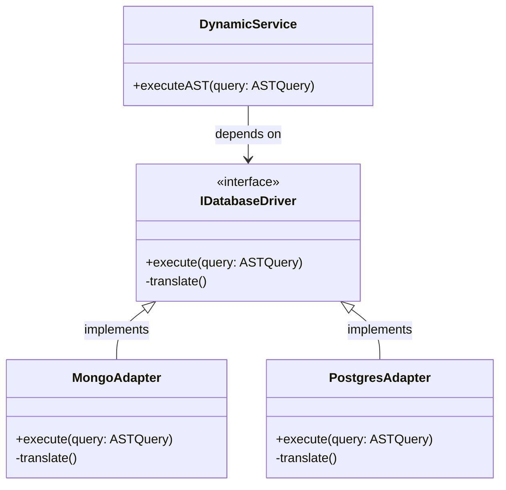
```mermaid
classDiagram
    class DynamicService {
        +executeAST(query: ASTQuery)
    }
    class IDatabaseDriver {
        <<interface>>
        +execute(query: ASTQuery)
		-translate()
    }
    class MongoAdapter {
        +execute(query: ASTQuery)
        -translate()
    }
    class PostgresAdapter {
        +execute(query: ASTQuery)
        -translate()
    }
    DynamicService --> IDatabaseDriver : depends on
    IDatabaseDriver <|-- MongoAdapter : implements
    IDatabaseDriver <|-- PostgresAdapter : implements
```

#### **The adapter in action**
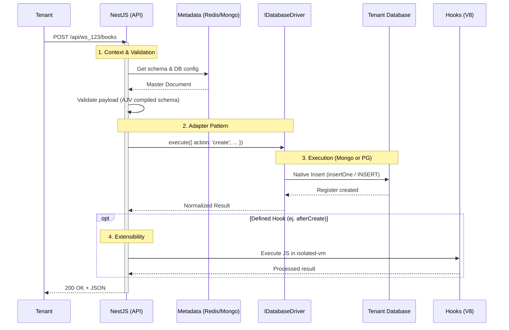
```mermaid
sequenceDiagram
  participant T as Tenant
  participant API as NestJS (API)
  participant Config as Metadata (Redis/Mongo)
  participant Adapt as IDatabaseDriver
  participant DB as Tenant Database
  participant H as Hooks (V8)

  T->>API: POST /api/ws_123/books
  activate API

  Note over API: 1. Context & Validation
  API->>Config: Get schema & DB config
  Config-->>API: Master Document
    API->>API: Validate payload (AJV compiled schema)

  Note over API, Adapt: 2. Adapter Pattern
  API->>Adapt: execute({ action: 'create', ... })
  
  Note over Adapt, DB: 3. Execution (Mongo or PG)
  Adapt->>DB: Native Insert (insertOne / INSERT)
  DB-->>Adapt: Register created
  Adapt-->>API: Normalized Result

  opt Defined Hook (ej. afterCreate)
    Note over API: 4. Extensibility
    API->>H: Execute JS in isolated-vm
    H-->>API: Processed result
  end

  API-->>T: 200 OK + JSON
  deactivate API
```

### Phase 3: Dynamic API Engine

- `TenantInterceptor` — extracts tenant from URL, loads Master Document (Redis cache → MongoDB fallback), attaches to request context
- `DynamicController` (310 lines) — universal CRUD: `GET/POST/PUT/PATCH/DELETE /:tenantId/:entity/:id`
- `DynamicService` (383 lines) — orchestration: resolve entity → validate → call adapter → transform response
- `GET /:tenantId/_discovery` — returns full schema map for client SDK consumption

### Phase 4: Validation Engine

- `ValidationEngine` (248 lines) — AJV-based runtime validation
- Compiles JSON Schema validators from `EntityDefinition` at runtime
- Caches compiled validators per `tenantId:entity:version`
- Validates every POST/PUT/PATCH body before adapter execution
- Type coercion: string → number, ISO date parsing
- Pre-warming hot validators is the intended mitigation against first-request cold starts

### Phase 5: ABAC Authorization

- `PolicyEngine` — CASL-based ability compilation from Master Document permissions
- Role-based: `admin`, `editor`, `viewer` with configurable access
- Attribute-based: field-level visibility, row-level filtering
- `PolicyGuard` — runs after TenantInterceptor, before DynamicController

### Module Build Phase 1: DDL + Provisioner + Crypto

- Extended `IDatabaseAdapter` with DDL methods (`collectionExists`, `createCollection`, `dropCollection`, `ensureIndexes`)
- `system-entities.ts` (912 lines) — 16 system entity schemas as `EntityDefinition` constants
- `EncryptionService` — AES-256-GCM with `MASTER_ENCRYPTION_KEY`
- `ProvisionerService` — idempotent system entity provisioning
- `TenantService.activate()` rewritten: connect → provision → generate secrets → encrypt → store

### Module Build Phase 2: Auth Core

- `PasswordService` — bcrypt + per-tenant pepper (12 rounds, pepper decrypted at runtime)
- `TokenService` — per-tenant JWT signing/verification via @nestjs/jwt
- `IdentityService` — user CRUD on `_baas_users` via adapter
- `AuthService` (435 lines) — register, login, refresh, forgot/reset password, change password, account lockout
- `TenantJwtAuthGuard` — per-tenant JWT verification guard
- `AuthController` — 7 endpoints at `api/:tenantId/auth/*`
- DTOs with class-validator decorators

### Module Build Phase 3: Sessions + RBAC

- `SessionService` (208 lines) — session lifecycle, multi-device tracking, bulk revocation
- `RoleService` (316 lines) — role/permission CRUD, permission checking
- `RolesGuard` + `@Roles()` decorator
- `PermissionsGuard` + `@RequirePermission()` decorator
- Default role seeding during provisioning

### Module Build Phase 4: GDPR + Audit

- `AuditService` — mutation logging, entity history, user activity trail
- `GdprService` (421 lines) — consent management, data export, deletion lifecycle (request → process → anonymize)
- `GdprController` (205 lines) — 8 endpoints covering full GDPR compliance flow

### Module Build Phase 5: Communication

- `MailService` — per-tenant SMTP via nodemailer, transporter caching, encrypted credentials
- `NotificationService` — CRUD on `_baas_notifications`, unread counts, broadcast
- `NewsletterService` (198 lines) — double opt-in, subscribe/confirm/unsubscribe, stats
- Controllers for notifications and newsletter

### Module Build Phase 6: Platform

- `FileService` — metadata in `_baas_files`, local storage, MIME/size validation
- `AnalyticsService` — event tracking, batch ingestion, summary queries
- `WebhookService` (241 lines) — CRUD, HMAC-SHA256 signed delivery, logs, auto-disable on failures
- `ApiKeyService` — key generation (`baas_sk_*`), SHA-256 hashing, scope validation
- `ApiKeyGuard` — `x-api-key` header auth with scope enforcement

### Module Build Phase 7: Security Hardening

- `IpFilterGuard` — per-tenant IP whitelist/blacklist with CIDR support
- `TenantRateLimiterGuard` — sliding window rate limiter, per-tenant keying
- `SanitizationGuard` — global protection against NoSQL injection, SQL injection, XSS, prototype pollution
- `TenantCorsMiddleware` — security headers (X-Frame-Options, X-Content-Type-Options, Referrer-Policy, Permissions-Policy)
- `SecurityModule` — aggregates all guards, applies middleware to `api/*`

---

## Verification & Testing Strategy

### Compilation Verification

Every implementation phase was verified with:
```bash
npx tsc --noEmit   # Zero errors required
npx nest build     # Clean build required
```

### Integration Test Scenarios

| Test | Description | Verifies |
|---|---|---|
| **Polyglot Parity** | Create two tenants (PostgreSQL + MongoDB), run identical CRUD operations | Adapter pattern works across engines |
| **Auth Isolation** | Two tenants, same user password → different hashes | Per-tenant pepper isolation |
| **JWT Isolation** | Token from Tenant A rejected by Tenant B | Per-tenant JWT secret isolation |
| **Provisioning Idempotency** | Run `activate` twice on same tenant | System entities not duplicated |
| **GDPR Export** | Export user data → verify all system entities included, `passwordHash` excluded | Data portability compliance |
| **Webhook Delivery** | Register webhook → trigger event → verify delivery + HMAC signature | Webhook integrity |
| **Rate Limiting** | Exceed rate limit → verify 429 response with `Retry-After` header | Per-tenant rate limiting |
| **Sanitization** | Send `{ "$gt": "" }` in body → verify 400 rejection | NoSQL injection prevention |
| **Schema Discovery** | `GET /:tenantId/_discovery` → verify universal schema returned | Client SDK support |
| **Validation** | `POST /:tenantId/books { "title": 123 }` → verify 400 (title must be string) | Runtime validation |

---

## Key Architectural Decisions

### 1. Prisma Removed → Knex.js + Native Drivers

**Problem:** Prisma requires static schemas at build time (code generation, migrations). A BaaS discovers schemas at *runtime*.

**Decision:** Replace with [Knex.js](https://knexjs.org/) (SQL query builder covering 5 engines) + [MongoDB Node Driver](https://www.mongodb.com/docs/drivers/node/current/). Knex provides the same type-safe query building without requiring a schema file. MongoDB driver provides direct collection access.

**Result:** Single `IDatabaseAdapter` interface covers all 6 database engines. New engines can be added by implementing the interface.

### 2. MongoDB for the Control Plane

**Problem:** Where to store Master Documents (tenant metadata)?

**Alternatives considered:**
- PostgreSQL + JSONB: technically possible, but forces relational patterns on document-shaped data
- Shared MongoDB: purpose-built for nested JSON documents

**Decision:** MongoDB 7 for the Control Plane. Master Documents are inherently document-shaped — deeply nested, schema-variable, key-volatile JSON. MongoDB provides native change streams, flexible indexing, and JSON Schema validation at the DB level.

**Result:** Clean separation — MongoDB manages *system metadata*, tenant databases manage *business data*.

### 3. Adapter Pattern + Universal Query IR

**Problem:** How to make all modules database-agnostic?

**Alternatives considered:**
- Multi-ORM (different ORM per engine): duplicates all business logic
- GraphQL federation: adds unnecessary protocol complexity
- Adapter pattern with intermediate representation: used by Prisma, Hasura, Trino, Apache Calcite internally

**Decision:** Adapter pattern with a universal Query IR. Every module calls `adapter.findMany(entity, options)` — the adapter translates to `SELECT ... FROM ...` (SQL) or `db.collection.find(...)` (MongoDB).

**Result:** Zero engine-specific code in any module. 14 modules × 6 database engines = 84 combinations, all working through one interface.

### 4. Per-Tenant Auth, Not Centralized

**Problem:** Should users/sessions/roles live in a central system DB or in each tenant's own database?

**Decision:** Per-tenant. Users, sessions, roles, permissions — all stored as `_baas_*` entities in the tenant's own database, accessed through the universal adapter.

**Rationale:**
- True data isolation (GDPR compliance)
- Polyglot: auth works on any engine the tenant chose
- No cross-tenant data leakage possible by design
- Tenant can be fully exported/deleted without affecting others

### 5. Per-Tenant Pepper, Not Global

**Problem:** How to pepper bcrypt hashes?

**Decision:** Generate a unique 32-byte pepper per tenant at provisioning time. Encrypt with AES-256-GCM using `MASTER_ENCRYPTION_KEY`. Store encrypted in the Master Document.

**Rationale:** A global pepper means one compromise affects all tenants. Per-tenant pepper means an attacker needs:
1. Access to the tenant's database (gets hashed passwords)
2. Access to the Control Plane MongoDB (gets encrypted pepper)
3. The `MASTER_ENCRYPTION_KEY` environment variable (decrypts pepper)

All three are independent attack surfaces.

### 6. System Entity Prefix: `_baas_`

**Problem:** How to avoid collision between BaaS system tables and tenant business tables?

**Decision:** All 16 system entities are prefixed `_baas_` (e.g., `_baas_users`, `_baas_sessions`, `_baas_audit_log`).

**Result:** A tenant can have entities named `users`, `sessions`, `orders` — they won't collide with `_baas_users`, `_baas_sessions`. The underscore prefix also sorts them separately in database tools.

---

## Codebase Map

### File Structure (87 TypeScript files, ~11,800 lines)

```
srcs/src/
├── main.ts                              # Entry point (Helmet, CORS, Swagger)
├── app.module.ts                        # Root module (24 module imports)
├── health.controller.ts                 # GET /health
│
├── common/                              # Shared interfaces, types, utilities
│   ├── interfaces/
│   │   └── database-adapter.interface.ts   # IDatabaseAdapter (the core contract)
│   ├── types/
│   │   ├── schema.types.ts                 # UniversalSchemaMap, EntityDefinition
│   │   ├── query.types.ts                  # QueryIR, WhereClause, AggregateClause
│   │   └── tenant.types.ts                 # MasterDocument, TenantConfig
│   ├── schemas/
│   │   └── system-entities.ts              # 16 system entity definitions (912 lines)
│   ├── crypto/
│   │   ├── encryption.service.ts           # AES-256-GCM encryption
│   │   └── crypto.module.ts                # Global encryption module
│   ├── interceptors/
│   │   └── tenant.interceptor.ts           # Tenant context resolution
│   ├── decorators/
│   │   ├── adapter.decorator.ts            # @InjectAdapter()
│   │   └── tenant.decorator.ts             # @Tenant()
│   ├── exceptions/
│   │   └── all-exceptions.filter.ts        # Global exception handler
│   └── index.ts                            # Barrel exports
│
├── infrastructure/                      # External service connections
│   ├── system-db/
│   │   └── system-db.module.ts             # MongoDB/Mongoose connection
│   └── cache/
│       └── cache.module.ts                 # Redis/ioredis connection
│
├── modules/
│   ├── control-plane/                   # Tenant lifecycle & metadata
│   │   ├── control-plane.module.ts
│   │   ├── tenant/
│   │   │   ├── tenant.service.ts           # Tenant CRUD + activation
│   │   │   ├── tenant.controller.ts        # REST endpoints
│   │   │   ├── tenant.schema.ts            # Mongoose schema
│   │   │   └── dto/tenant.dto.ts
│   │   ├── metadata/
│   │   │   ├── metadata.service.ts         # Schema CRUD + versioning
│   │   │   ├── metadata.controller.ts
│   │   │   ├── schema-version.schema.ts
│   │   │   └── dto/metadata.dto.ts
│   │   ├── iam/
│   │   │   ├── iam.module.ts
│   │   │   └── policy.engine.ts            # CASL ABAC engine
│   │   └── provisioner/
│   │       ├── provisioner.service.ts      # System entity provisioning
│   │       └── provisioner.module.ts
│   │
│   ├── engines/                         # Database adapter implementations
│   │   ├── engines.module.ts
│   │   ├── core/
│   │   │   └── database-provider.factory.ts    # Adapter resolution + pooling
│   │   ├── sql/
│   │   │   └── sql.adapter.ts              # Knex.js (806 lines, 5 SQL engines)
│   │   └── nosql/
│   │       └── mongo.adapter.ts            # MongoDB native (647 lines)
│   │
│   ├── data-plane/                      # Dynamic API engine
│   │   ├── data-plane.module.ts
│   │   ├── dynamic-api/
│   │   │   ├── dynamic.controller.ts       # Universal CRUD endpoints
│   │   │   ├── dynamic.service.ts          # Request orchestration
│   │   │   └── dynamic-api.module.ts
│   │   └── validation/
│   │       ├── validation.engine.ts        # AJV runtime validation
│   │       └── validation.module.ts
│   │
│   ├── auth/                            # Per-tenant authentication
│   │   ├── auth.module.ts
│   │   ├── auth.controller.ts
│   │   ├── services/
│   │   │   ├── auth.service.ts             # Register, login, password reset
│   │   │   ├── password.service.ts         # bcrypt + pepper
│   │   │   ├── token.service.ts            # Per-tenant JWT
│   │   │   └── identity.service.ts         # User CRUD via adapter
│   │   ├── guards/
│   │   │   └── jwt-auth.guard.ts           # Per-tenant JWT verification
│   │   ├── decorators/
│   │   │   └── current-user.decorator.ts   # @CurrentUser()
│   │   └── dto/
│   │       └── auth.dto.ts                 # Register, Login, Reset DTOs
│   │
│   ├── session/                         # Session management
│   │   ├── session.module.ts
│   │   └── session.service.ts
│   │
│   ├── rbac/                            # Role-based access control
│   │   ├── rbac.module.ts
│   │   ├── services/
│   │   │   └── role.service.ts             # Role/permission CRUD
│   │   ├── guards/
│   │   │   ├── roles.guard.ts              # @Roles() enforcement
│   │   │   └── permissions.guard.ts        # @RequirePermission() enforcement
│   │   └── decorators/
│   │       └── roles.decorator.ts          # @Roles('admin', 'moderator')
│   │
│   ├── audit/                           # Audit trail
│   │   ├── audit.module.ts
│   │   └── audit.service.ts
│   │
│   ├── gdpr/                            # GDPR compliance
│   │   ├── gdpr.module.ts
│   │   ├── gdpr.service.ts
│   │   └── gdpr.controller.ts
│   │
│   ├── mail/                            # Per-tenant email
│   │   ├── mail.module.ts
│   │   └── mail.service.ts
│   │
│   ├── notification/                    # In-app notifications
│   │   ├── notification.module.ts
│   │   ├── notification.service.ts
│   │   └── notification.controller.ts
│   │
│   ├── newsletter/                      # Newsletter subscriptions
│   │   ├── newsletter.module.ts
│   │   ├── newsletter.service.ts
│   │   └── newsletter.controller.ts
│   │
│   ├── files/                           # File management
│   │   ├── file.module.ts
│   │   └── file.service.ts
│   │
│   ├── analytics/                       # Event analytics
│   │   ├── analytics.module.ts
│   │   ├── analytics.service.ts
│   │   └── analytics.controller.ts
│   │
│   ├── webhook/                         # Outgoing webhooks
│   │   ├── webhook.module.ts
│   │   ├── webhook.service.ts
│   │   └── webhook.controller.ts
│   │
│   ├── api-keys/                        # API key management
│   │   ├── api-key.module.ts
│   │   ├── api-key.service.ts
│   │   ├── api-key.guard.ts
│   │   └── api-key.controller.ts
│   │
│   └── security/                        # Security hardening
│       ├── security.module.ts
│       ├── guards/
│       │   ├── ip-filter.guard.ts
│       │   ├── rate-limiter.guard.ts
│       │   └── sanitization.guard.ts
│       └── middleware/
│           └── security-headers.middleware.ts
```

### Module Wiring (AppModule)

```typescript
@Module({
  imports: [
    // Configuration
    ConfigModule, ThrottlerModule, EventEmitterModule, ScheduleModule,

    // Infrastructure
    SystemDbModule,      // MongoDB (Control Plane)
    CacheModule,         // Redis
    CryptoModule,        // AES-256-GCM (global)

    // Control Plane
    ControlPlaneModule,  // Tenants, metadata, IAM, provisioner

    // Engine Layer
    EnginesModule,       // SQL adapter + NoSQL adapter + factory

    // Data Plane
    ValidationModule,    // AJV runtime validation
    DataPlaneModule,     // Dynamic CRUD API

    // Auth & Authorization
    AuthModule,          // Register, login, JWT, password reset
    SessionModule,       // Session lifecycle
    RbacModule,          // Roles + permissions

    // Compliance
    AuditModule,         // Mutation audit trail
    GdprModule,          // Consent, export, deletion

    // Communication
    MailModule,          // Per-tenant SMTP
    NotificationModule,  // In-app notifications
    NewsletterModule,    // Newsletter subscriptions

    // Platform
    FileModule,          // File upload & metadata
    AnalyticsModule,     // Event analytics
    WebhookModule,       // Outgoing webhooks
    ApiKeyModule,        // M2M authentication

    // Security
    SecurityModule,      // IP filter, rate limiter, sanitization
  ],
})
export class AppModule {}
```

---

## Future Roadmap

The following phases are planned but not yet implemented:

### Phase 8: Hook Sandbox

Execute user-defined JavaScript hooks in secure V8 isolates using `isolated-vm`:
- Lifecycle hooks: `beforeCreate`, `afterCreate`, `beforeUpdate`, `afterUpdate`, `beforeDelete`, `afterDelete`
- Time limit (5s), memory limit (128MB), no network access
- Hooks receive entity data, return modified data or throw to abort

### Phase 9: Background Jobs

Async task queue using [BullMQ](https://docs.bullmq.io/) + [Redis](https://redis.io/docs/latest/):
- Webhook delivery retries with exponential backoff
- Email sending queue
- Schema introspection jobs
- Scheduled cleanup (expired sessions, old audit logs)

### Phase 10: Billing & Usage Metering

- Usage event emission from Data Plane: `{ tenantId, eventType, unitsConsumed, timestamp }`
- Canonical event types include `read`, `write`, `storage`, and `hook_cpu`
- Billing aggregator in Control Plane
- Tier enforcement (request limits, storage limits, entity count limits)
- Schema versioning endpoints: `GET /_schema/versions`, `POST /_schema/rollback/:version`

Billing is intentionally off the request path: the Data Plane emits usage events, and the Control Plane aggregates them asynchronously. Request handling should never block on billing computation.


#### ***Pattern Diagram***

The Computed Pattern **pre-calculates values** that would otherwise require expensive aggregations on every read. The cost of computation is paid **once at write time**; all subsequent reads are instantaneous.

> Core principle: *"Pay the cost once when writing, rather than paying it every time when reading."*


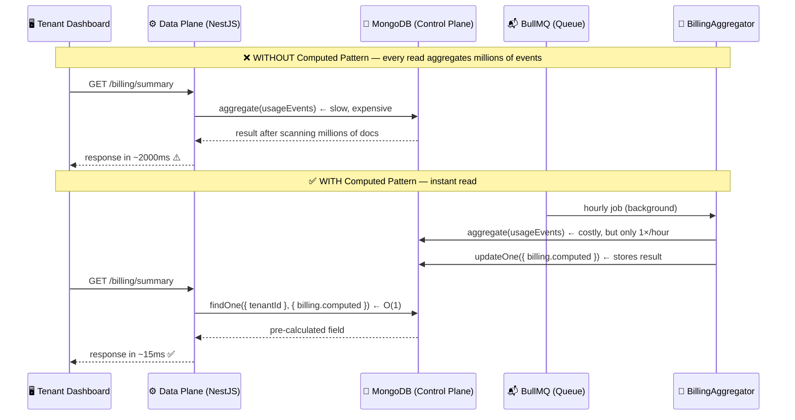
```mermaid
sequenceDiagram
    participant Dashboard as 🖥️ Tenant Dashboard
    participant DataPlane as ⚙️ Data Plane (NestJS)
    participant MongoDB as 🍃 MongoDB (Control Plane)
    participant BullMQ as 📬 BullMQ (Queue)
    participant Aggregator as 🧮 BillingAggregator

    Note over Dashboard,Aggregator: ❌ WITHOUT Computed Pattern — every read aggregates millions of events
    Dashboard->>DataPlane: GET /billing/summary
    DataPlane->>MongoDB: aggregate(usageEvents) ← slow, expensive
    MongoDB-->>DataPlane: result after scanning millions of docs
    DataPlane-->>Dashboard: response in ~2000ms ⚠️

    Note over Dashboard,Aggregator: ✅ WITH Computed Pattern — instant read
    BullMQ->>Aggregator: hourly job (background)
    Aggregator->>MongoDB: aggregate(usageEvents) ← costly, but only 1×/hour
    Aggregator->>MongoDB: updateOne({ billing.computed }) ← stores result
    Dashboard->>DataPlane: GET /billing/summary
    DataPlane->>MongoDB: findOne({ tenantId }, { billing.computed }) ← O(1)
    MongoDB-->>DataPlane: pre-calculated field
    DataPlane-->>Dashboard: response in ~15ms ✅
```

> **Reading this diagram:** The top half shows the naive approach — each dashboard request triggers a full aggregation scan of potentially millions of `UsageEvents`. The bottom half shows how the Computed Pattern inverts this: the expensive aggregation runs once per hour in the background (via BullMQ), and the result is stored directly inside the `TenantMetadata` document. Dashboard reads become a simple `findOne`, dropping response time from ~2000ms to ~15ms regardless of how much historical data exists.

---

The Approximation Pattern accepts statistically valid values instead of exact figures for **high-volume, low-criticality metrics**, reducing write operations by up to 99% and freeing up resources for truly critical operations.

> *"Good enough is often good enough."*

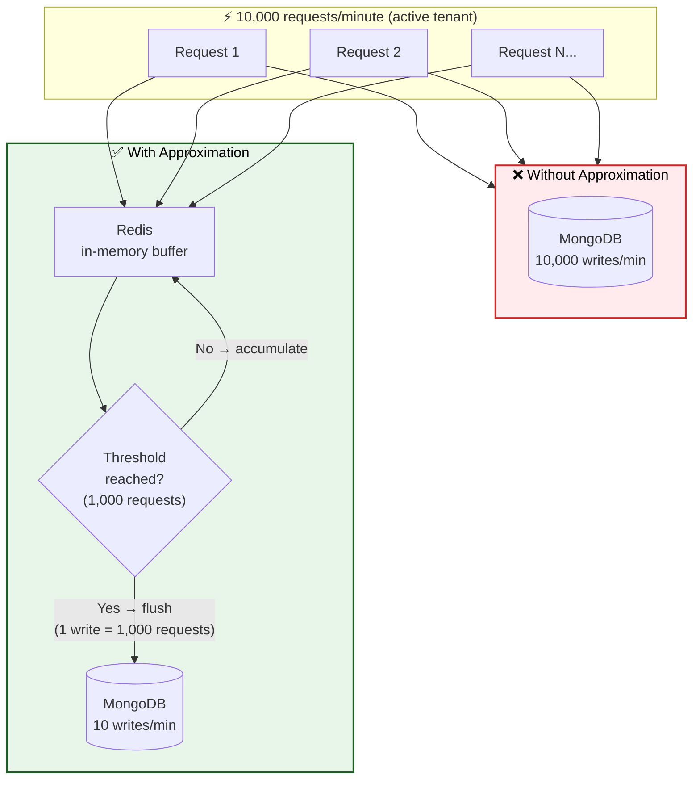
```mermaid
graph TD
    subgraph Requests["⚡ 10,000 requests/minute (active tenant)"]
        R1[Request 1]
        R2[Request 2]
        RN[Request N...]
    end

    subgraph Without["❌ Without Approximation"]
        W1[(MongoDB
		10,000 writes/min)]
    end

    subgraph With["✅ With Approximation"]
        Redis["Redis
		in-memory buffer"]
        Threshold{"Threshold
		reached?
		(1,000 requests)"}
        W2[(MongoDB
		10 writes/min)]
    end

    R1 --> Without
    R2 --> Without
    RN --> Without

    R1 --> Redis
    R2 --> Redis
    RN --> Redis
    Redis --> Threshold
    Threshold -->|"Yes → flush
	(1 write = 1,000 requests)"| W2
    Threshold -->|No → accumulate| Redis

    style Without fill:#ffebee,stroke:#c62828,stroke-width:2px,color:#000
    style With fill:#e8f5e9,stroke:#1b5e20,stroke-width:2px,color:#000
```

> **Reading this diagram:** Both sides receive the same 10,000 requests per minute. Without the pattern, every single request triggers a MongoDB write — the database becomes the bottleneck. With the pattern, each request increments a counter in Redis (an in-memory operation, essentially free). Only when that counter crosses the threshold of 1,000 does a single write go to MongoDB. The result is a 99.9% reduction in write operations, with the counter in MongoDB staying statistically accurate for all practical purposes (trend analysis, dashboards, reporting).

### Phase 11: First Tenant — Vite Gourmand Migration

Validate the entire BaaS with a real application:
- Use `SqlIntrospector` to auto-discover Vite Gourmand's 37 PostgreSQL tables
- Generate a `UniversalSchemaMap` from the introspected schema
- Create a tenant Master Document with engine `postgresql`
- Verify all CRUD operations work through `DynamicController` with zero hardcoded routes

### Operational Deployment Topology

The baseline production deployment separates control and execution concerns at the infrastructure level as well:

```text
Kubernetes Cluster
├── control-plane namespace
├── data-plane namespace
├── redis
└── monitoring stack
```

Enterprise isolation tiers can add:
- Dedicated namespace per tenant
- Dedicated database per tenant
- Separate autoscaling group or node pool for premium workloads
- NetworkPolicy and secret boundaries per tenant environment

### Governance and Enforced Limits

Governance in mini-baas means the platform can automatically enforce safety, fairness, and predictability rather than depending on convention.

Every tenant should have enforceable limits for:
- Maximum entities
- Maximum fields per entity
- Maximum payload size
- Maximum hook CPU / execution budget
- Maximum requests per minute

These rules belong in the Control Plane and are enforced in the gateway and Data Plane.

### System Maturity Stages

The platform evolves in explicit stages:
- **Stage 1** — Logical multi-tenancy
- **Stage 2** — Query DSL + policy injection
- **Stage 3** — Versioned metadata
- **Stage 4** — Billing + quotas
- **Stage 5** — Enterprise isolation tiers

### Non-Negotiable Principles

1. Metadata is the source of truth.
2. Isolation must exist at every layer.
3. Control Plane and Data Plane must remain separable.
4. The platform must not claim guarantees stronger than the weakest supported engine.
5. Every feature must be tenant-aware.
6. Performance must be cache-driven where repetition exists.
7. Governance must be enforceable automatically, not socially.

---

